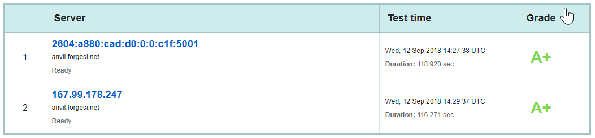

It seemed like a good idea to try something new with this website.  I settled on running the fancy blogging software Ghost because it looked pretty, has a wonderful editing experience (with markdown support), and (most importantly) I'd never used it before.

<!--more-->

I have a VPS through Digital Ocean hosting this site and a few other things.  I wanted to use that VPS rather than maintaining yet another machine.  There are a couple things about Ghost that make me uncomfortable installing it on the bare machine.
1. It requires a specific globally installed version of Node
2. It doesn't install using Ubuntu's packing system but is, instead, installed using its own deployment script
3. There is no support for running multiple Ghost instances on a single machine 

I wanted to:
* Limit to impact on the bare machine
* Have the ability to run multiple Ghost instances
* Run Ghost behind NGINX and have NGINX handle SSL termination (LetsEncrypt)
* Have some sort of safe mechanism for performing upgrades
* Isolate the Ghost process as much as possible so that if it turns evil its impact on the rest of the system is minimized

This seemed like an ideal project to deploy under Docker.  This post is mostly documentation of that process so that future Jeff (when he has to fix something) remembers how this worked.

Fortunately, I'm not the first to want to deploy Ghost using Docker so there are a number of Docker images.  I picked the official one here.

Getting it up and running is fairly easy:

```
docker run --name ghost-forgesi \
        -p 127.0.0.1:13003:2368 \
        -d ghost:alpine
```

That starts the Ghost docker image and exposes it on port 13003 on localhost.

Next step is to configure NGINX to forward requests for my website through to my Ghost instance.  

I added a new site on `sites-available` and symlinked that into `sites-enabled` for my website "forgesi.net".  
In this case I have forgesi.net:80 www.forgesi.net:80 and forgesi.net:443 all redirecting to www.forgesi.net:443 so there are a couple bonus server containers in my configuration.

```
# Redirect HTTP traffic to www.forgesi.net:443
server {
  listen       80;
  listen       [::]:80;
  server_name  forgesi.net www.forgesi.net;
  return 301 https://www.forgesi.net$request_uri;
}

# Redirect forgesi.net HTTPS traffic to www.forgesi.net:443
server {
  listen       443 ssl;
  listen       [::]:443 ssl;
  server_name  forgesi.net;
  ssl                  on;
  ssl_certificate /etc/letsencrypt/live/forgesi.net/fullchain.pem; # managed by Certbot
  ssl_certificate_key /etc/letsencrypt/live/forgesi.net/privkey.pem; # managed by Certbot
  include /etc/nginx/ssl_params;
  return 301 https://www.forgesi.net$request_uri;

}

# Main Server Configuration
server {
  listen       443 ssl;
  listen       [::]:443 ssl;
  server_name  www.forgesi.net;
  root         /var/www/forgesi.net;
  index index.html;

  access_log /var/log/nginx/access.log;

  ssl                  on;
  ssl_certificate /etc/letsencrypt/live/forgesi.net/fullchain.pem; # managed by Certbot
  ssl_certificate_key /etc/letsencrypt/live/forgesi.net/privkey.pem; # managed by Certbot

  include /etc/nginx/ssl_params;

  # If a physical file exists in DocRoot host that, otherwise pass through to Ghost
  location / {
    try_files $uri $uri @forgesighost;
  }

  location @forgesighost {
    proxy_pass  http://127.0.0.1:13003;
    proxy_set_header Host $http_host;
    proxy_set_header X-NginX-Proxy true;
    proxy_set_header X-Real-IP $remote_addr;
    proxy_set_header X-Forwarded-For $proxy_add_x_forwarded_for;
    proxy_set_header X-Forwarded-Proto https;
  }

}
```

The SSL certificates in the above configuration were created by LetsEncrypt.  When I originally created this file I just used whatever self-signed cert I had kicking around and then let LetsEncrypt take it over.

```
$ sudo apt install python-certbot-nginx
$ sudo certbot --nginx -d forgesi.net -d www.forgesi.net
$ sudo service nginx restart
```

The `/etc/nginx/ssl_params` file mentioned in the configuration are just some parameters that help be get a A+ rating on SSL labs:



```
ssl_session_timeout  5m;
ssl_protocols TLSv1 TLSv1.1 TLSv1.2;
ssl_ciphers ECDH+AESGCM:DH+AESGCM:ECDH+AES256:DH+AES256:ECDH+AES128:DH+AES:ECDH+3DES:DH+3DES:RSA+AESGCM:RSA+AES:RSA+3DES:!aNULL:!MD5:!DSS;
ssl_dhparam /etc/nginx/dhparam.pem;
add_header Strict-Transport-Security "max-age=31536000";
ssl_prefer_server_ciphers   on;
```

After making the above configuration changes, starting the Ghost Docker image, and restarting nginx, I can now connect to my Ghost test server.  
There are, however, some problems I need to address:
* The Ghost image doesn't know its server name (many links are pointing to localhost)
* The Ghost image doesn't know how to send email (for lost passwords)
* The Ghost process is running as user 1000 which overlaps with a local user account on the host system
* All content is stored within the Ghost image and lost when I restart/upgrade the image.

The following script deletes and recreates my Docker container and resolves the above issues.
* It uses Mailgun for mail delivery (Mailgun has a good free tier)
* It runs as user 1001 (A dedicated user for this)
* All data is persisted to /var/lib/ghost/forgesi on the server machine (making it easy to backup, and allowing it to persist across upgrades)

```sh
#!/bin/sh

docker rm -f ghost-forgesi

docker run --name ghost-forgesi \
        -p 127.0.0.1:13003:2368 \
        --user 1001 \
        -e url=https://www.forgesi.net \
        -e mail__transport=SMTP \
        -e mail__from=noreply@mg.forgesi.net \
        -e mail__options__service=Mailgun \
        -e mail__options__auth__user=postmaster@mg.forgesi.net \
        -e mail__options__auth__pass=ZZZZZZ \
        -v /var/lib/ghost/forgesi:/var/lib/ghost/content \
        --restart=always \
        -d ghost:alpine
```

Now, when Ghost is upgraded, I can update my image with a docker pull ghost:alpine and then rebuild my container with the above script.
