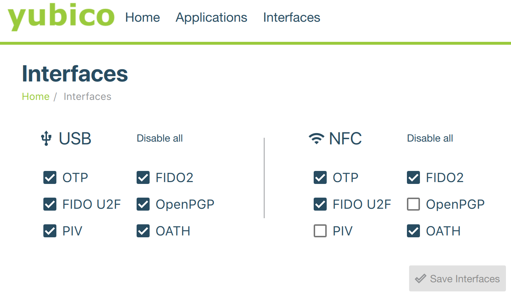

Yubico just announced the new YubiKey 5 and of course I needed to buy one!  This gave me a great opportunity to update my somewhat popular [GPG/SSH with YubiKey guide](/post/2015/gpg-smartcard/).

The YubiKey 5 includes support for:

* Universal Second Factor (U2F) - FIDO & FIDO 2! (nothing uses FIDO 2 but I had to have it ;)
* CCID Smart Card: RSA (and now ECC) / OpenPGP 
* NFC (starting to be supported by some iOS apps)

This guide walks through:
1. Generating a secure set of GPG keys and storing them on the YubiKey
2. Configuring GPG to use the YubiKey for cryptographic operations (signing / decryption)
3. Configuring SSH to use the keys stored on the YubiKey for authorization

**While this guide talks about the YubiKey 5 this should work for any OpenPGP compatible smart card.**

# Why?

The obvious question is why would you do any of this?  It's a $50 gadget, a lot of work, and a fair bit of inconvenience to move one's GPG/SSH keys to a YubiKey.  Why do it?

I jump between a number of different computers.  Some of them are computers I own, and some are not.  Some of them are reasonably locked down, and some of them are not.  Unfortunately, I often need to sign messages (commits) or SSH to remote systems from any of these machines.  I really don't like the idea of storing my SSH or GPG keys on these machines.  If the machine gets owned, I could loose control of my private key and whoever gets that key can decrypted my encrypted files and messages, and connect to my servers until that key is retired.

Storing the keys on a tamper proof piece of hardware like a YubiKey, protected by a PIN, lessens the risk significantly.  An attacker, theoretically, can never obtain my private keys.  The worst they could do is perform an active attack where, while my YubiKey is plugged in and after I type my PIN, they can execute software on my computer that asks it to do crypto operations without me knowing.  Fortunately, the YubiKey has a status indicator light and has a touch-to-sign/encrypt feature that largely mitigates this.

So, assuming you are on board, let's go!

# Other Resources

There are many other guides on the Internet for this type of thing.  Here are a few I used for reference.

* [DrDuh's YubiKey Guide](https://github.com/drduh/YubiKey-Guide/blob/master/README.md)
* [Ageis Guide](https://gist.github.com/ageis/14adc308087859e199912b4c79c4aaa4)

# Configuration

## Configuring the YubiKey for U2F & CCID
Unlike previous YubiKey versions where OpenPGP, SmartCard, and U2F were off by default, it's all ready to go with the YubiKey 5.  

You can use the YubiKey Manager to fine-tune which services are available over USB vs. NFC, however. 
s


## Air-gapped Machine Setup

The next step is to setup a secure machine to do the key generation.  You don't want to do this on your normal machine (or at least, not your normal OS) because that defeats most of the purpose of storing your keys on a smartcard. When we're done, we'll backup the key material on a couple of flash drives and then turn off the machine, virtually guaranteeing our private key can never be copied by someone else.

I have an old Dell Latitude, that I use for this purpose.  It has a DVD drive and I've long ago removed the HDD.  It has a physical ethernet port and I've disabled WiFi, which means it's really easy to take away Internet from this machine when I'm ready to do so. 

For the offline key generation steps, I used the Debian 9.5.0 XFCE live DVD image (debian-live-9.5.0-amd64-xfce.iso).  It was easy to get up and running and, being a live DVD, it has no persistence.  Tails would be another good option that would allow you to keep your keys on your bootable image rather than storing backups externally.  Debian 9.5.0 includes most of the software we need for this offline key generation step so we just need to add the GnuPG Smart Card daemon (scdaemon).  We'll also add Haveged (the entropy gathering daemon).  One thing I wish I had in this process was some sort of hardware RNG because that's probably the weak point in my whole process.

```
user@debian:~$ sudo apt update
user@debian:~$ sudo apt install scdaemon haveged
```

Once that's installed, we can plug in the YubiKey and check that GnuPG can talk to it:

```
user@debian:~$ gpg --card-status
Reader ...........: 1050:0407:X:0
Application ID ...: D2760????????
Version ..........: 2.1
Manufacturer .....: Yubico
Serial number ....: 08692085
Name of cardholder: [not set]
Language prefs ...: [not set]
Sex ..............: unspecified
URL of public key : [not set]
Login data .......: [not set]
Signature PIN ....: not forced
Key attributes ...: rsa2048 rsa2048 rsa2048
Max. PIN lengths .: 127 127 127
PIN retry counter : 3 0 3
Signature counter : 0
Signature key ....: [none]
Encryption key....: [none]
Authentication key: [none]
General key info..: [none]
```

Success.  That was easy.  Other Linux distros might require you to mess with UDEV rules to get the YubiKey recognized but, fortunately, this is not required in modern Debian images.

Now let's configure GnuPG with some stronger defaults (taken from riseup.net):

```
$ mkdir ~/.gnupg
$ cat > ~/.gnupg/gpg.conf << !
no-emit-version
no-comments
keyid-format 0xlong
with-fingerprint
use-agent
personal-cipher-preferences AES256 AES192 AES CAST5
personal-digest-preferences SHA512 SHA384 SHA256 SHA224
cert-digest-algo SHA512
default-preference-list SHA512 SHA384 SHA256 SHA224 AES256 AES192 AES CAST5 ZLIB BZIP2 ZIP Uncompressed
!
```

At this point, we no longer need Internet access so unplug the cable or disconnect from WiFi.

## Generating GPG Keys

{}
Do not proceed until you have disconnected your machine from the Internet.
{}

Here is a sample set of keys that I’m generating. The master key is  reserved for key signing and certifying the sub-keys. There are distinct  sub-keys for signing, encryption and authentication (SSH).  Each of these separate sub-keys will be loaded into the matching slot on the YubiKey OpenPGP module.

Here is a sample of the keys we are generating:

```
user@debian:~$ gpg -k
/home/user/.gnupg/pubring.kbx
-----------------------------
pub   rsa4096/0xD60BAB29C43A7D86 2018-10-06 [SC] [expires: 2020-10-05]
      Key fingerprint = 4E60 B17E 5655 1F34 2FCB  E021 D60B AB29 C43A 7D86
uid                   [ultimate] Test User <test@testcorp.com>
uid                   [ultimate] Test User <test@keybase.io>
sub   rsa4096/0xC7BE201051104674 2018-10-06 [S] [expires: 2019-10-06]
sub   rsa4096/0xD091C8246D6E716F 2018-10-06 [E] [expires: 2019-10-06]
sub   rsa4096/0xD4CB0F888A5233F9 2018-10-06 [A] [expires: 2019-10-06]
```

The first step is creating our Master Key.  When prompted for a password, generate a good one.  I prefer "[dice-ware](http://world.std.com/~reinhold/diceware.html)" passphrases like the following because they are just as strong as a short random alphanumeric string but are much easier to write down on paper and not screw up.  It's also feels somewhat ceremonial to be generating important passwords with a set of dice. 

```
nerrancy microanalytical ouistiti unstring sexennially
```

This password will help protect your key if someone finds your backup flash drive.  Also, while it's tempting to make keys that never expire, don't.  It's fairly easy to update the expiry date periodically and an expiry date protects you in the event that you lose access to your key (i.e. you don't have multiple valid keys floating our there for eternity).

```
user@debian:~$ gpg --full-generate-key
gpg (GnuPG) 2.1.18; Copyright (C) 2017 Free Software Foundation, Inc.
This is free software: you are free to change and redistribute it.
There is NO WARRANTY, to the extent permitted by law.

Please select what kind of key you want:
   (1) RSA and RSA (default)
   (2) DSA and Elgamal
   (3) DSA (sign only)
   (4) RSA (sign only)
Your selection? 4
RSA keys may be between 1024 and 4096 bits long.
What keysize do you want? (2048) 4096
Requested keysize is 4096 bits
Please specify how long the key should be valid.
         0 = key does not expire
      <n>  = key expires in n days
      <n>w = key expires in n weeks
      <n>m = key expires in n months
      <n>y = key expires in n years
Key is valid for? (0) 2y
Key expires at Mon 05 Oct 2020 03:22:53 PM UTC
Is this correct? (y/N) y

GnuPG needs to construct a user ID to identify your key.

Real name: Test User
Email address: test@testcorp.com
Comment: 
You selected this USER-ID:
    "Test User <test@testcorp.com>"

Change (N)ame, (C)omment, (E)mail or (O)kay/(Q)uit? o
We need to generate a lot of random bytes. It is a good idea to perform
some other action (type on the keyboard, move the mouse, utilize the
disks) during the prime generation; this gives the random number
generator a better chance to gain enough entropy.
          gpg: /home/user/.gnupg/trustdb.gpg: trustdb created
gpg: key 0xD60BAB29C43A7D86 marked as ultimately trusted
gpg: directory '/home/user/.gnupg/openpgp-revocs.d' created
gpg: revocation certificate stored as '/home/user/.gnupg/openpgp-revocs.d/4E60B17E56551F342FCBE021D60BAB29C43A7D86.rev'
public and secret key created and signed.

Note that this key cannot be used for encryption.  You may want to use
the command "--edit-key" to generate a subkey for this purpose.
pub   rsa4096/0xD60BAB29C43A7D86 2018-10-06 [SC] [expires: 2020-10-05]
      Key fingerprint = 4E60 B17E 5655 1F34 2FCB  E021 D60B AB29 C43A 7D86
uid                              Test User <test@testcorp.com>
```

At this point, we can edit the key and add additional email addresses and, if we're feeling crazy (I'm not), a photo.  In this case, I use Keybase.io so I'll also add my Keybase identity.  You can add additional email addresses in the same way.

```
user@debian:~$ gpg --edit-key 0xD60BAB29C43A7D86
gpg (GnuPG) 2.1.18; Copyright (C) 2017 Free Software Foundation, Inc.
This is free software: you are free to change and redistribute it.
There is NO WARRANTY, to the extent permitted by law.

Secret key is available.

gpg: checking the trustdb
gpg: marginals needed: 3  completes needed: 1  trust model: pgp
gpg: depth: 0  valid:   1  signed:   0  trust: 0-, 0q, 0n, 0m, 0f, 1u
gpg: next trustdb check due at 2020-10-05
sec  rsa4096/0xD60BAB29C43A7D86
     created: 2018-10-06  expires: 2020-10-05  usage: SC  
     trust: ultimate      validity: ultimate
[ultimate] (1). Test User <test@testcorp.com>

gpg> adduid
Real name: Test User
Email address: test@keybase.io
Comment: 
You selected this USER-ID:
    "Test User <test@keybase.io>"

Change (N)ame, (C)omment, (E)mail or (O)kay/(Q)uit? o

sec  rsa4096/0xD60BAB29C43A7D86
     created: 2018-10-06  expires: 2020-10-05  usage: SC  
     trust: ultimate      validity: ultimate
[ultimate] (1)  Test User <test@testcorp.com>
[ unknown] (2). Test User <test@keybase.io>

gpg> uid 1 

sec  rsa4096/0xD60BAB29C43A7D86
     created: 2018-10-06  expires: 2020-10-05  usage: SC  
     trust: ultimate      validity: ultimate
[ultimate] (1)* Test User <test@testcorp.com>
[ unknown] (2). Test User <test@keybase.io>

gpg> primary

sec  rsa4096/0xD60BAB29C43A7D86
     created: 2018-10-06  expires: 2020-10-05  usage: SC  
     trust: ultimate      validity: ultimate
[ultimate] (1)* Test User <test@testcorp.com>
[ unknown] (2)  Test User <test@keybase.io>

gpg> save
```

The next step is to generate our sub-keys for signing, encryption and authentication.  These are the keys that will be loaded onto my YubiKey.  The YubiKey 4 & 5 support 4096bit keys so that's what I'm using here but earlier YubiKeys only support up to 2048bit keys.
First, we'll add the Signing Sub-key.

```
user@debian:~$ gpg --expert --edit-key 0xD60BAB29C43A7D86
gpg (GnuPG) 2.1.18; Copyright (C) 2017 Free Software Foundation, Inc.
This is free software: you are free to change and redistribute it.
There is NO WARRANTY, to the extent permitted by law.

Secret key is available.

sec  rsa4096/0xD60BAB29C43A7D86
     created: 2018-10-06  expires: 2020-10-05  usage: SC  
     trust: ultimate      validity: ultimate
[ultimate] (1). Test User <test@testcorp.com>
[ultimate] (2)  Test User <test@keybase.io>

gpg> addkey
Please select what kind of key you want:
   (3) DSA (sign only)
   (4) RSA (sign only)
   (5) Elgamal (encrypt only)
   (6) RSA (encrypt only)
   (7) DSA (set your own capabilities)
   (8) RSA (set your own capabilities)
  (10) ECC (sign only)
  (11) ECC (set your own capabilities)
  (12) ECC (encrypt only)
  (13) Existing key
Your selection? 4
RSA keys may be between 1024 and 4096 bits long.
What keysize do you want? (2048) 4096
Requested keysize is 4096 bits
Please specify how long the key should be valid.
         0 = key does not expire
      <n>  = key expires in n days
      <n>w = key expires in n weeks
      <n>m = key expires in n months
      <n>y = key expires in n years
Key is valid for? (0) 1y
Key expires at Sun 06 Oct 2019 03:37:31 PM UTC
Is this correct? (y/N) y
Really create? (y/N) y
We need to generate a lot of random bytes. It is a good idea to perform
some other action (type on the keyboard, move the mouse, utilize the
disks) during the prime generation; this gives the random number
generator a better chance to gain enough entropy.

sec  rsa4096/0xD60BAB29C43A7D86
     created: 2018-10-06  expires: 2020-10-05  usage: SC  
     trust: ultimate      validity: ultimate
ssb  rsa4096/0xC7BE201051104674
     created: 2018-10-06  expires: 2019-10-06  usage: S   
[ultimate] (1). Test User <test@testcorp.com>
[ultimate] (2)  Test User <test@keybase.io>

gpg> q
Save changes? (y/N) y
```

Next, we'll add our Encryption sub-key:

```
user@debian:~$ gpg --expert --edit-key 0xD60BAB29C43A7D86
gpg (GnuPG) 2.1.18; Copyright (C) 2017 Free Software Foundation, Inc.
This is free software: you are free to change and redistribute it.
There is NO WARRANTY, to the extent permitted by law.

Secret key is available.

sec  rsa4096/0xD60BAB29C43A7D86
     created: 2018-10-06  expires: 2020-10-05  usage: SC  
     trust: ultimate      validity: ultimate
ssb  rsa4096/0xC7BE201051104674
     created: 2018-10-06  expires: 2019-10-06  usage: S   
[ultimate] (1). Test User <test@testcorp.com>
[ultimate] (2)  Test User <test@keybase.io>

gpg> addkey
Please select what kind of key you want:
   (3) DSA (sign only)
   (4) RSA (sign only)
   (5) Elgamal (encrypt only)
   (6) RSA (encrypt only)
   (7) DSA (set your own capabilities)
   (8) RSA (set your own capabilities)
  (10) ECC (sign only)
  (11) ECC (set your own capabilities)
  (12) ECC (encrypt only)
  (13) Existing key
Your selection? 6
RSA keys may be between 1024 and 4096 bits long.
What keysize do you want? (2048) 4096
Requested keysize is 4096 bits
Please specify how long the key should be valid.
         0 = key does not expire
      <n>  = key expires in n days
      <n>w = key expires in n weeks
      <n>m = key expires in n months
      <n>y = key expires in n years
Key is valid for? (0) 1y
Key expires at Sun 06 Oct 2019 03:42:17 PM UTC
Is this correct? (y/N) y
Really create? (y/N) y
We need to generate a lot of random bytes. It is a good idea to perform
some other action (type on the keyboard, move the mouse, utilize the
disks) during the prime generation; this gives the random number
generator a better chance to gain enough entropy.

sec  rsa4096/0xD60BAB29C43A7D86
     created: 2018-10-06  expires: 2020-10-05  usage: SC  
     trust: ultimate      validity: ultimate
ssb  rsa4096/0xC7BE201051104674
     created: 2018-10-06  expires: 2019-10-06  usage: S   
ssb  rsa4096/0xD091C8246D6E716F
     created: 2018-10-06  expires: 2019-10-06  usage: E   
[ultimate] (1). Test User <test@testcorp.com>
[ultimate] (2)  Test User <test@keybase.io>

gpg> q
Save changes? (y/N) y
```

And, finally, we'll add our Authentication sub-key:

```
user@debian:~$ gpg --expert --edit-key 0xD60BAB29C43A7D86
gpg (GnuPG) 2.1.18; Copyright (C) 2017 Free Software Foundation, Inc.
This is free software: you are free to change and redistribute it.
There is NO WARRANTY, to the extent permitted by law.

Secret key is available.

sec  rsa4096/0xD60BAB29C43A7D86
     created: 2018-10-06  expires: 2020-10-05  usage: SC  
     trust: ultimate      validity: ultimate
ssb  rsa4096/0xC7BE201051104674
     created: 2018-10-06  expires: 2019-10-06  usage: S   
ssb  rsa4096/0xD091C8246D6E716F
     created: 2018-10-06  expires: 2019-10-06  usage: E   
[ultimate] (1). Test User <test@testcorp.com>
[ultimate] (2)  Test User <test@keybase.io>

gpg> addkey
Please select what kind of key you want:
   (3) DSA (sign only)
   (4) RSA (sign only)
   (5) Elgamal (encrypt only)
   (6) RSA (encrypt only)
   (7) DSA (set your own capabilities)
   (8) RSA (set your own capabilities)
  (10) ECC (sign only)
  (11) ECC (set your own capabilities)
  (12) ECC (encrypt only)
  (13) Existing key
Your selection? 8

Possible actions for a RSA key: Sign Encrypt Authenticate 
Current allowed actions: Sign Encrypt 

   (S) Toggle the sign capability
   (E) Toggle the encrypt capability
   (A) Toggle the authenticate capability
   (Q) Finished

Your selection? s

Possible actions for a RSA key: Sign Encrypt Authenticate 
Current allowed actions: Encrypt 

   (S) Toggle the sign capability
   (E) Toggle the encrypt capability
   (A) Toggle the authenticate capability
   (Q) Finished

Your selection? e

Possible actions for a RSA key: Sign Encrypt Authenticate 
Current allowed actions: 

   (S) Toggle the sign capability
   (E) Toggle the encrypt capability
   (A) Toggle the authenticate capability
   (Q) Finished

Your selection? a

Possible actions for a RSA key: Sign Encrypt Authenticate 
Current allowed actions: Authenticate 

   (S) Toggle the sign capability
   (E) Toggle the encrypt capability
   (A) Toggle the authenticate capability
   (Q) Finished

Your selection? q
RSA keys may be between 1024 and 4096 bits long.
What keysize do you want? (2048) 4096
Requested keysize is 4096 bits
Please specify how long the key should be valid.
         0 = key does not expire
      <n>  = key expires in n days
      <n>w = key expires in n weeks
      <n>m = key expires in n months
      <n>y = key expires in n years
Key is valid for? (0) 1y
Key expires at Sun 06 Oct 2019 03:48:26 PM UTC
Is this correct? (y/N) y
Really create? (y/N) y
We need to generate a lot of random bytes. It is a good idea to perform
some other action (type on the keyboard, move the mouse, utilize the
disks) during the prime generation; this gives the random number
generator a better chance to gain enough entropy.

sec  rsa4096/0xD60BAB29C43A7D86
     created: 2018-10-06  expires: 2020-10-05  usage: SC  
     trust: ultimate      validity: ultimate
ssb  rsa4096/0xC7BE201051104674
     created: 2018-10-06  expires: 2019-10-06  usage: S   
ssb  rsa4096/0xD091C8246D6E716F
     created: 2018-10-06  expires: 2019-10-06  usage: E   
ssb  rsa4096/0xD4CB0F888A5233F9
     created: 2018-10-06  expires: 2019-10-06  usage: A   
[ultimate] (1). Test User <test@testcorp.com>
[ultimate] (2)  Test User <test@keybase.io>

gpg> q
Save changes? (y/N) y
```

At this point, we've generated our master key and three sub-keys and they are all stored in our GnuPG keychain on our air-gapped machine.

### Generating a Revocation Certificate

While we're at it, you should generate a revocation certificate.  A revocation certificate is used if/when you lose control of your key and want to indicate to the key servers that the key should no longer be used.  There are several reasons for revoking a key but we'll assume that if we're revoking it in a hurry, it's because our key was compromised.

First, let's make a directory to store the files we need to be backing up on our USB flash drive.

```
user@debian:~$ mkdir ~/gpg
```

Next, let's generate a revocation certificate and store it in our new folder:

```
user@debian:~$ gpg --gen-revoke 0xD60BAB29C43A7D86 > ~/gpg/revoke.asc

sec  rsa4096/0xD60BAB29C43A7D86 2018-10-06 Test User <test@testcorp.com>

Create a revocation certificate for this key? (y/N) y
Please select the reason for the revocation:
  0 = No reason specified
  1 = Key has been compromised
  2 = Key is superseded
  3 = Key is no longer used
  Q = Cancel
(Probably you want to select 1 here)
Your decision? 1
Enter an optional description; end it with an empty line:
> 
Reason for revocation: Key has been compromised
(No description given)
Is this okay? (y/N) y
ASCII armored output forced.
Revocation certificate created.

Please move it to a medium which you can hide away; if Mallory gets
access to this certificate he can use it to make your key unusable.
It is smart to print this certificate and store it away, just in case
your media become unreadable.  But have some caution:  The print system of
your machine might store the data and make it available to others!
```

### Backing up your GPG Keys
Before you proceed, you'll want to backup your current keys because the next step is moving part of your key onto the YubiKey.  If you don't make a backup now: (best case) you need to generate new sub-keys, (worst case) you might lose access to your entire key.

Let's extract the secret key and store it in an ascii file in our gpg folder. 

```
user@debian:~$ gpg -a --output ~/gpg/0xD60BAB29C43A7D86.master.asc --export-secret-key 0xD60BAB29C43A7D86
user@debian:~$ gpg -a --output ~/gpg/0xD60BAB29C43A7D86.subkeys.asc --export-secret-subkey 0xD60BAB29C43A7D86
```

For good measure, let's also backup the enture ~/.gnupg folder:

```
user@debian:~$ tar -czf ~/gpg/gnupg_folder.tgz ~/.gnupg/
tar: Removing leading `/' from member names
```

And, copy our GPG configuration because it'll be helpful in a second:

```
user@debian:~$ cp ~/.gnupg/gpg.conf ~/gpg/gpg.conf
```

At this point, backup the contents of ~/gpg to two+ USB flash drives.  These flash drives should **never** be plugged into an Internet connected computer again.

Now, once the backup is made, let's test this:

```
user@debian:~$ ps aux | grep gpg-agent
user      2852  0.5  0.1  91608  3320 ?        SLs  16:03   0:01 /usr/bin/gpg-agent --supervised
user      2927  0.0  0.0  12784   984 pts/1    S+   16:08   0:00 grep gpg-agent
user@debian:~$ kill -9 2852
user@debian:~$ rm -rf ~/.gnupg/
user@debian:~$ mkdir ~/.gnupg/
user@debian:~$ chmod 700 ~/.gnupg/
user@debian:~$ cp ~/gpg/gpg.conf ~/.gnupg/
user@debian:~$ gpg --import ~/gpg/0xD60BAB29C43A7D86.master.asc  ~/gpg/0xD60BAB29C43A7D86.subkeys.asc 
gpg: keybox '/home/user/.gnupg/pubring.kbx' created
gpg: /home/user/.gnupg/trustdb.gpg: trustdb created
gpg: key 0xD60BAB29C43A7D86: public key "Test User <test@testcorp.com>" imported
gpg: key 0xD60BAB29C43A7D86: secret key imported
gpg: key 0xD60BAB29C43A7D86: "Test User <test@testcorp.com>" not changed
gpg: To migrate 'secring.gpg', with each smartcard, run: gpg --card-status
gpg: key 0xD60BAB29C43A7D86: secret key imported
gpg: Total number processed: 2
gpg:               imported: 1
gpg:              unchanged: 1
gpg:       secret keys read: 2
gpg:   secret keys imported: 1
gpg:  secret keys unchanged: 1
```

Let's re-mark our key as trusted:

```
user@debian:~$ gpg --edit-key 0xD60BAB29C43A7D86
gpg (GnuPG) 2.1.18; Copyright (C) 2017 Free Software Foundation, Inc.
This is free software: you are free to change and redistribute it.
There is NO WARRANTY, to the extent permitted by law.

Secret key is available.

sec  rsa4096/0xD60BAB29C43A7D86
     created: 2018-10-06  expires: 2020-10-05  usage: SC  
     trust: unknown       validity: unknown
ssb  rsa4096/0xC7BE201051104674
     created: 2018-10-06  expires: 2019-10-06  usage: S   
ssb  rsa4096/0xD091C8246D6E716F
     created: 2018-10-06  expires: 2019-10-06  usage: E   
ssb  rsa4096/0xD4CB0F888A5233F9
     created: 2018-10-06  expires: 2019-10-06  usage: A   
[ unknown] (1). Test User <test@testcorp.com>
[ unknown] (2)  Test User <test@keybase.io>

gpg> trust
sec  rsa4096/0xD60BAB29C43A7D86
     created: 2018-10-06  expires: 2020-10-05  usage: SC  
     trust: unknown       validity: unknown
ssb  rsa4096/0xC7BE201051104674
     created: 2018-10-06  expires: 2019-10-06  usage: S   
ssb  rsa4096/0xD091C8246D6E716F
     created: 2018-10-06  expires: 2019-10-06  usage: E   
ssb  rsa4096/0xD4CB0F888A5233F9
     created: 2018-10-06  expires: 2019-10-06  usage: A   
[ unknown] (1). Test User <test@testcorp.com>
[ unknown] (2)  Test User <test@keybase.io>

Please decide how far you trust this user to correctly verify other users' keys
(by looking at passports, checking fingerprints from different sources, etc.)

  1 = I don't know or won't say
  2 = I do NOT trust
  3 = I trust marginally
  4 = I trust fully
  5 = I trust ultimately
  m = back to the main menu

Your decision? 5
Do you really want to set this key to ultimate trust? (y/N) y

sec  rsa4096/0xD60BAB29C43A7D86
     created: 2018-10-06  expires: 2020-10-05  usage: SC  
     trust: ultimate      validity: unknown
ssb  rsa4096/0xC7BE201051104674
     created: 2018-10-06  expires: 2019-10-06  usage: S   
ssb  rsa4096/0xD091C8246D6E716F
     created: 2018-10-06  expires: 2019-10-06  usage: E   
ssb  rsa4096/0xD4CB0F888A5233F9
     created: 2018-10-06  expires: 2019-10-06  usage: A   
[ unknown] (1). Test User <test@testcorp.com>
[ unknown] (2)  Test User <test@keybase.io>
Please note that the shown key validity is not necessarily correct
unless you restart the program.

gpg> quit
```

At this point, our local GPG keychain is restored from our backup (~/gpg) so we are ready to load the sub-keys into our YubiKey.

## Loading GPG Keys onto the YubiKey

Use `gpg –-card-edit` to edit the user information and PINs for the smart card.

* **User PIN** - this is the day-to-day PIN required to use your key to sign/decrypt/authenticate
* **Admin PIN** - this PIN is required to make changes to the smart card and is not used day-to-day
* **URL**  - this is the location of your public key file and can be used by GnuPG  to download your key in new installations. 
My  environment uses the graphical PIN entry program so you don’t see PIN  prompts below but you will be prompted after many of the operations for a  PIN.

<table>
    <tr>
        <th>Default Admin PIN</th><td>12345678</td>
    </tr>
    <tr>
        <th>Default PIN</th><td>123456</td>
    </tr>
</table>

### Conflicts with built-in SmartCard Readers

If the machine you are using has a built-in Smartcard  reader (many business laptops) you may receive “Card not present“  errors. If this happens you may need to change the default reader for  scdaemon to your Yubikey. Find a list of ports with:

```
$ echo scd getinfo  reader_list | gpg-connect-agent –decode | awk ’/^D/ {print $2}’
```

The  above command outputs something like:1050:0116:X:0 Add the following to  ~/.gnupg/scdaemon.conf (based on the output of the previous  command)

```
reader-port 1050:0116:X:0
```

Alternatively, if you aren’t using the  built-in Smartcard reader, you can also just deactivate it in the OS.

### Configuring the Smart Card

```
user@debian:~$ gpg --card-edit

Reader ...........: 1050:0407:X:0
Application ID ...: D2760001240102010006086920850000
Version ..........: 2.1
Manufacturer .....: Yubico
Serial number ....: 08692085
Name of cardholder: [not set]
Language prefs ...: [not set]
Sex ..............: unspecified
URL of public key : [not set]
Login data .......: [not set]
Signature PIN ....: not forced
Key attributes ...: rsa2048 rsa2048 rsa2048
Max. PIN lengths .: 127 127 127
PIN retry counter : 3 0 3
Signature counter : 0
Signature key ....: [none]
Encryption key....: [none]
Authentication key: [none]
General key info..: [none]

gpg/card> admin
Admin commands are allowed

gpg/card> passwd
gpg: OpenPGP card no. D2760001240102010006086920850000 detected

1 - change PIN
2 - unblock PIN
3 - change Admin PIN
4 - set the Reset Code
Q - quit

Your selection? 1
PIN changed.

1 - change PIN
2 - unblock PIN
3 - change Admin PIN
4 - set the Reset Code
Q - quit

Your selection? 3
PIN changed.

1 - change PIN
2 - unblock PIN
3 - change Admin PIN
4 - set the Reset Code
Q - quit

Your selection? q

gpg/card> url
URL to retrieve public key: https://keybase.io/test/key.asc

gpg/card> name
Cardholder's surname: User
Cardholder's given name: Test

gpg/card> login
Login data (account name): tuser

gpg/card> sex
Sex ((M)ale, (F)emale or space): M

gpg/card> lang
Language preferences: en

gpg/card> list

Reader ...........: 1050:0407:X:0
Application ID ...: D2760001240102010006086920850000
Version ..........: 2.1
Manufacturer .....: Yubico
Serial number ....: 08692085
Name of cardholder: Test User
Language prefs ...: en
Sex ..............: male
URL of public key : https://keybase.io/test/key.asc
Login data .......: tuser
Signature PIN ....: not forced
Key attributes ...: rsa2048 rsa2048 rsa2048
Max. PIN lengths .: 127 127 127
PIN retry counter : 3 0 3
Signature counter : 0
Signature key ....: [none]
Encryption key....: [none]
Authentication key: [none]
General key info..: [none]
gpg/card> quit
```

### Moving Sub-keys to the YubiKey

Now that our card is ready to go, we can move our sub-keys out of our GPG keychain, and onto the YubiKey.

```
user@debian:~$ gpg --edit-key 0xD60BAB29C43A7D86
gpg (GnuPG) 2.1.18; Copyright (C) 2017 Free Software Foundation, Inc.
This is free software: you are free to change and redistribute it.
There is NO WARRANTY, to the extent permitted by law.

Secret key is available.

gpg: checking the trustdb
gpg: marginals needed: 3  completes needed: 1  trust model: pgp
gpg: depth: 0  valid:   1  signed:   0  trust: 0-, 0q, 0n, 0m, 0f, 1u
gpg: next trustdb check due at 2020-10-05
sec  rsa4096/0xD60BAB29C43A7D86
     created: 2018-10-06  expires: 2020-10-05  usage: SC  
     trust: ultimate      validity: ultimate
ssb  rsa4096/0xC7BE201051104674
     created: 2018-10-06  expires: 2019-10-06  usage: S   
ssb  rsa4096/0xD091C8246D6E716F
     created: 2018-10-06  expires: 2019-10-06  usage: E   
ssb  rsa4096/0xD4CB0F888A5233F9
     created: 2018-10-06  expires: 2019-10-06  usage: A   
[ultimate] (1). Test User <test@testcorp.com>
[ultimate] (2)  Test User <test@keybase.io>

gpg> toggle

sec  rsa4096/0xD60BAB29C43A7D86
     created: 2018-10-06  expires: 2020-10-05  usage: SC  
     trust: ultimate      validity: ultimate
ssb  rsa4096/0xC7BE201051104674
     created: 2018-10-06  expires: 2019-10-06  usage: S   
ssb  rsa4096/0xD091C8246D6E716F
     created: 2018-10-06  expires: 2019-10-06  usage: E   
ssb  rsa4096/0xD4CB0F888A5233F9
     created: 2018-10-06  expires: 2019-10-06  usage: A   
[ultimate] (1). Test User <test@testcorp.com>
[ultimate] (2)  Test User <test@keybase.io>

gpg> key 1

sec  rsa4096/0xD60BAB29C43A7D86
     created: 2018-10-06  expires: 2020-10-05  usage: SC  
     trust: ultimate      validity: ultimate
ssb* rsa4096/0xC7BE201051104674
     created: 2018-10-06  expires: 2019-10-06  usage: S   
ssb  rsa4096/0xD091C8246D6E716F
     created: 2018-10-06  expires: 2019-10-06  usage: E   
ssb  rsa4096/0xD4CB0F888A5233F9
     created: 2018-10-06  expires: 2019-10-06  usage: A   
[ultimate] (1). Test User <test@testcorp.com>
[ultimate] (2)  Test User <test@keybase.io>

gpg> keytocard
Please select where to store the key:
   (1) Signature key
   (3) Authentication key
Your selection? 1

sec  rsa4096/0xD60BAB29C43A7D86
     created: 2018-10-06  expires: 2020-10-05  usage: SC  
     trust: ultimate      validity: ultimate
ssb* rsa4096/0xC7BE201051104674
     created: 2018-10-06  expires: 2019-10-06  usage: S   
ssb  rsa4096/0xD091C8246D6E716F
     created: 2018-10-06  expires: 2019-10-06  usage: E   
ssb  rsa4096/0xD4CB0F888A5233F9
     created: 2018-10-06  expires: 2019-10-06  usage: A   
[ultimate] (1). Test User <test@testcorp.com>
[ultimate] (2)  Test User <test@keybase.io>

gpg> key 1

sec  rsa4096/0xD60BAB29C43A7D86
     created: 2018-10-06  expires: 2020-10-05  usage: SC  
     trust: ultimate      validity: ultimate
ssb  rsa4096/0xC7BE201051104674
     created: 2018-10-06  expires: 2019-10-06  usage: S   
ssb  rsa4096/0xD091C8246D6E716F
     created: 2018-10-06  expires: 2019-10-06  usage: E   
ssb  rsa4096/0xD4CB0F888A5233F9
     created: 2018-10-06  expires: 2019-10-06  usage: A   
[ultimate] (1). Test User <test@testcorp.com>
[ultimate] (2)  Test User <test@keybase.io>

gpg> key 2

sec  rsa4096/0xD60BAB29C43A7D86
     created: 2018-10-06  expires: 2020-10-05  usage: SC  
     trust: ultimate      validity: ultimate
ssb  rsa4096/0xC7BE201051104674
     created: 2018-10-06  expires: 2019-10-06  usage: S   
ssb* rsa4096/0xD091C8246D6E716F
     created: 2018-10-06  expires: 2019-10-06  usage: E   
ssb  rsa4096/0xD4CB0F888A5233F9
     created: 2018-10-06  expires: 2019-10-06  usage: A   
[ultimate] (1). Test User <test@testcorp.com>
[ultimate] (2)  Test User <test@keybase.io>

gpg> keytocard
Please select where to store the key:
   (2) Encryption key
Your selection? 2

sec  rsa4096/0xD60BAB29C43A7D86
     created: 2018-10-06  expires: 2020-10-05  usage: SC  
     trust: ultimate      validity: ultimate
ssb  rsa4096/0xC7BE201051104674
     created: 2018-10-06  expires: 2019-10-06  usage: S   
ssb* rsa4096/0xD091C8246D6E716F
     created: 2018-10-06  expires: 2019-10-06  usage: E   
ssb  rsa4096/0xD4CB0F888A5233F9
     created: 2018-10-06  expires: 2019-10-06  usage: A   
[ultimate] (1). Test User <test@testcorp.com>
[ultimate] (2)  Test User <test@keybase.io>

gpg> key 2

sec  rsa4096/0xD60BAB29C43A7D86
     created: 2018-10-06  expires: 2020-10-05  usage: SC  
     trust: ultimate      validity: ultimate
ssb  rsa4096/0xC7BE201051104674
     created: 2018-10-06  expires: 2019-10-06  usage: S   
ssb  rsa4096/0xD091C8246D6E716F
     created: 2018-10-06  expires: 2019-10-06  usage: E   
ssb  rsa4096/0xD4CB0F888A5233F9
     created: 2018-10-06  expires: 2019-10-06  usage: A   
[ultimate] (1). Test User <test@testcorp.com>
[ultimate] (2)  Test User <test@keybase.io>

gpg> key 3

sec  rsa4096/0xD60BAB29C43A7D86
     created: 2018-10-06  expires: 2020-10-05  usage: SC  
     trust: ultimate      validity: ultimate
ssb  rsa4096/0xC7BE201051104674
     created: 2018-10-06  expires: 2019-10-06  usage: S   
ssb  rsa4096/0xD091C8246D6E716F
     created: 2018-10-06  expires: 2019-10-06  usage: E   
ssb* rsa4096/0xD4CB0F888A5233F9
     created: 2018-10-06  expires: 2019-10-06  usage: A   
[ultimate] (1). Test User <test@testcorp.com>
[ultimate] (2)  Test User <test@keybase.io>

gpg> keytocard
Please select where to store the key:
   (3) Authentication key
Your selection? 3

sec  rsa4096/0xD60BAB29C43A7D86
     created: 2018-10-06  expires: 2020-10-05  usage: SC  
     trust: ultimate      validity: ultimate
ssb  rsa4096/0xC7BE201051104674
     created: 2018-10-06  expires: 2019-10-06  usage: S   
ssb  rsa4096/0xD091C8246D6E716F
     created: 2018-10-06  expires: 2019-10-06  usage: E   
ssb* rsa4096/0xD4CB0F888A5233F9
     created: 2018-10-06  expires: 2019-10-06  usage: A   
[ultimate] (1). Test User <test@testcorp.com>
[ultimate] (2)  Test User <test@keybase.io>

gpg> save
```

## Enabling Touch-to-Sign/Decrypt (optional)
The YubiKey 4+ have support for touch-to-auth/encrypt/sign.  I like this a lot because that means some malicious thing running on my work computer can't wait for me to authenticate to my YubiKey and then ask it to silently decrypt every message I've ever encrypted without me knowing.
You'll need the "ykman" command which can be found [here](https://developers.yubico.com/yubikey-manager/).  

```
» ykman openpgp touch enc on                            
Current touch policy of ENCRYPT key is OFF.
Set touch policy of ENCRYPT key to ON? [y/N]: y
Enter admin PIN:
Touch policy successfully set.

» ykman openpgp touch sig on                                                
Current touch policy of SIGN key is OFF.
Set touch policy of SIGN key to ON? [y/N]: y
Enter admin PIN:
Touch policy successfully set.
```

This was actually kind of a pain to install of the Debian machine.  I ended up resetting the admin PIN, doing it on my Mac, and then putting the admin PIN back.

# Sharing your Public Key

## Extracting your Public Key
Use GnuPG to export your public key in ascii-armoured format. This can  be safely distributed to others who want to communicate securely with  you (after an out-of-band verification of the fingerprint of course).

```
gpg --export -a --output ~/gpg/0xD60BAB29C43A7D86.pub.asc 0xD60BAB29C43A7D86
```

This file can be copied onto another USB flash drive (not the same one has your secret keys) and carried over to your Internet connected machine for distribution.

You'll also need to load your public key onto your real workstations and then associate your YubiKey with them.

## Distributing your Public Key
Anyone who wants to encrypt content for you or verify signatures you've made will need a copy of your public key.  There are a handful of common ways to distribute the key:
1. In Person
2. Using GPG/PGP Key Servers
3. Using Keybase.io

## Updating / Adding a GPG key to Keybase.io

If you already have a PGP key associated with Keybase.io and you want to replace it, run:

```
$ keybase pgp list
## find ID for your PGP key
$ keybase pgp drop [KEYID]
```

Now that there is no PGP key associated with your account, you can select your new key and add it to Keybase with the following:

```
$ keybase pgp select
```


# Configuring your Workstation

## MacOS

Getting up and running with the YubiKey on MacOS (Mojave for me) is pretty easy.
Start by installing GPG Suite (you may want to unselect the Mail.app plugin since that now costs money).
Next, I use the following for my `~/.gnupg/gpg.conf` file.  Make sure to update the default-key parameter to your Key ID.

```
no-greeting
require-cross-certification

keyserver hkps://hkps.pool.sks-keyservers.net
keyserver-options no-honor-keyserver-url

auto-key-locate https://hkps.pool.sks-keyservers.net
auto-key-retrieve

cert-digest-algo SHA512
default-preference-list SHA512 SHA384 SHA256 SHA224 AES256 AES192 AES CAST5 ZLIB BZIP2 ZIP Uncompressed
personal-digest-preferences SHA512 SHA384 SHA256 SHA224
no-emit-version

no-comments
keyid-format 0xlong
with-fingerprint
use-agent

default-key 0x????? # CHANGE
```

The following for `~/.gnupg/gpg-agent.conf`

```
default-cache-ttl 600
max-cache-ttl 7200
enable-ssh-support
write-env-file
```

And we want to setup GnuPG to use the keyservers at sks-keyservers.net. To do so, we'll need to download their certificate.

```
» curl https://sks-keyservers.net/sks-keyservers.netCA.pem > ~/.gnupg/sks-keyservers.netCA.pem
```

And add the following to `~/.gnupg/dirmngr.conf`.

```
keyserver hkps://hkps.pool.sks-keyservers.net
hkp-cacert $HOME/.gnupg/sks-keyservers.netCA.pem
```

To enable SSH support, I also add the following to my `.zshrc` (or `.bashrc`)

```
if [ -f "${HOME}/.gpg-agent-info" ]; then
     . "${HOME}/.gpg-agent-info"
       export GPG_AGENT_INFO
       export SSH_AUTH_SOCK
       export SSH_AGENT_PID
fi
```

At this point you should be able import your public key (the non-secret one from a USB flash drive that doesn't contain your private key).

```
$ gpg --import 0xD60BAB29C43A7D86.pub.asc
```

And, if we plug in our YubiKey at this moment we can have GnuPG associate our private keys (on the YubiKey) with our public key in the keychain with:

```
$ gpg --card-status
// which should show the detail of your smart card
```

Because this is your key, you should edit it and mark it as trusted.

```
user@debian:~$ gpg --edit-key 0xD60BAB29C43A7D86
gpg (GnuPG) 2.1.18; Copyright (C) 2017 Free Software Foundation, Inc.
This is free software: you are free to change and redistribute it.
There is NO WARRANTY, to the extent permitted by law.

Secret key is available.

sec  rsa4096/0xD60BAB29C43A7D86
     created: 2018-10-06  expires: 2020-10-05  usage: SC  
     trust: unknown       validity: unknown
ssb  rsa4096/0xC7BE201051104674
     created: 2018-10-06  expires: 2019-10-06  usage: S   
ssb  rsa4096/0xD091C8246D6E716F
     created: 2018-10-06  expires: 2019-10-06  usage: E   
ssb  rsa4096/0xD4CB0F888A5233F9
     created: 2018-10-06  expires: 2019-10-06  usage: A   
[ unknown] (1). Test User <test@testcorp.com>
[ unknown] (2)  Test User <test@keybase.io>

gpg> trust
sec  rsa4096/0xD60BAB29C43A7D86
     created: 2018-10-06  expires: 2020-10-05  usage: SC  
     trust: unknown       validity: unknown
ssb  rsa4096/0xC7BE201051104674
     created: 2018-10-06  expires: 2019-10-06  usage: S   
ssb  rsa4096/0xD091C8246D6E716F
     created: 2018-10-06  expires: 2019-10-06  usage: E   
ssb  rsa4096/0xD4CB0F888A5233F9
     created: 2018-10-06  expires: 2019-10-06  usage: A   
[ unknown] (1). Test User <test@testcorp.com>
[ unknown] (2)  Test User <test@keybase.io>

Please decide how far you trust this user to correctly verify other users' keys
(by looking at passports, checking fingerprints from different sources, etc.)

  1 = I don't know or won't say
  2 = I do NOT trust
  3 = I trust marginally
  4 = I trust fully
  5 = I trust ultimately
  m = back to the main menu

Your decision? 5
Do you really want to set this key to ultimate trust? (y/N) y

sec  rsa4096/0xD60BAB29C43A7D86
     created: 2018-10-06  expires: 2020-10-05  usage: SC  
     trust: ultimate      validity: unknown
ssb  rsa4096/0xC7BE201051104674
     created: 2018-10-06  expires: 2019-10-06  usage: S   
ssb  rsa4096/0xD091C8246D6E716F
     created: 2018-10-06  expires: 2019-10-06  usage: E   
ssb  rsa4096/0xD4CB0F888A5233F9
     created: 2018-10-06  expires: 2019-10-06  usage: A   
[ unknown] (1). Test User <test@testcorp.com>
[ unknown] (2)  Test User <test@keybase.io>
Please note that the shown key validity is not necessarily correct
unless you restart the program.

gpg> quit
```

You can quickly test your card by encrypting a message to yourself.  

**Note**: It will prompt for your PIN.  Once you correctly type your PIN notice the YubiKey light is blinking.  This is Touch-to-Sign requesting you press the button to confirm the signature.  Do that.


```
$ echo hello | gpg -esr test@testcorp.com --output message.gpg
gpg: using "0xD60BAB29C43A7D86" as default secret key for signing
```

And we can decrypt it and verify the signature with:

```
$ gpg -d message.gpg
gpg: encrypted with 4096-bit RSA key, ID 0xC7BE201051104674, created 2018-10-06
      "Test User <test@testcorp.com>"
hello
gpg: Signature made Sun Oct  7 09:40:05 2018 MDT
gpg:                using RSA key ??????
gpg: Good signature from "Test User <test@testcorp.com>" [ultimate]
....
```

So GnuPG is working great.  Next up, SSH.

Fortunately, this is easy. 

Find our what your SSH key is by running:

```
$ ssh-add -L
ssh-rsa AAA......0t431i5Q== cardno:00000000000
```

Take the output of that command and add it to the `~/.ssh/authorized_keys` file on a remote host.

You should now be able to ssh to that host and, when you do, you'll see the PIN prompt for your YubiKey (unless you were speedy and it remembered from the last time you typed it - GpgAgent remembers for a little while).

## Ubuntu Linux (TBD)
## Windows (TBD)
## QubesOS (TBD)