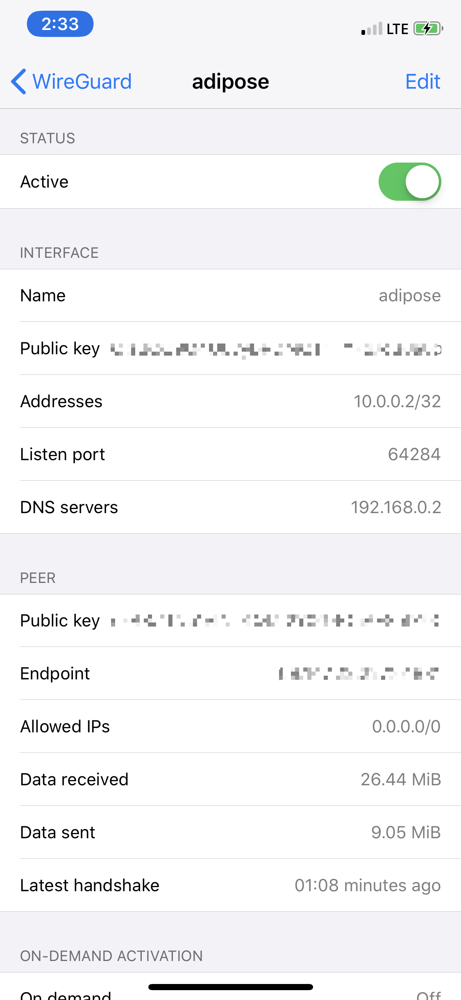

For years, I’ve relied on SSH as the gateway into my LAN from the outside world.  I figure that, as far as services I could place on “the front-line” go, it’s pretty solid. It sure beats publicly exposed RDP right?!

My usual setup is to configure Linux and OpenSSH Server on a Separate VM or RaspberryPi, and forward inbound SSH requests to that machine.  I prohibit password-based logins in `/etc/ssh/sshd_config` and also install and configure DuoSecurity’s PAM module as an additional layer when logging in from the outside world over SSH.  I like this layering because OpenSSH’s public-key authentication has to succeed before DuoSecurity’s PAM module (which I trust less than base-SSH) is invoked.  DuoSecurity works exceptionally well because it can be configured to send a push message to my phone which I can approve (from my phone) without requiring any further user interaction in my SSH client (handy when using SSH in non-interactive mode).  This setup works well, and I leverage SSH port forwarding to tunnel traffic through to my LAN.

As awesome as OpenSSH port forwarding is, however, it’s still not the same as being on the LAN.  I end up needing to add inconvenient port mappings for internal services I want to connect to.  It’s difficult to manage.  It doesn’t support UDP.  It causes problems accessing HTTP services with Virtual Hosting or SNI.

With my recent network rebuild, it seemed like a great opportunity to install a  better VPN server.  My Ubiquiti USG only supports IPSec / L2TP, and I have concerns about my ability to configure and manage these heavyweights (honestly, I wasn’t even 100% sure that encryption was enabled and that I was not sending unencrypted traffic).  I’ve used OpenVPN in the past, but it’s a bit of a pain to setup and manage.  OpenVPN is also slow when breaking connections and reconnecting on mobile devices.

I opted to run with [Wireguard](https://wireguard.com) because it’s fairly easy to configure, light-weight, supports all the devices I’m likely to use, and it works very well with roaming mobile devices (similar to MOSH, it’s UDP-based tunnel can survive IP address changes).  Most of the concerns I’ve seen around Wireguard are that it’s too new (I do share that concern), and concern around privacy (maintaining a static mapping to internal IP for each client - not an issue for my use case).  Wireguard has been around for quite a few years now, has received a reasonable amount of scrutiny, and is in production use at several VPN companies already (such as [Mullvad](https://mullvad.net/en/guides/why-wireguard/)).  

Ideologically, I really like Wireguard.  In stark contrast to the other VPN technologies which support a bewildering array of cipher-suites and options, Wireguard is tiny and supports only a minimal set of modern crypto algorithms.  Where technologies like IPSec and OpenVPN (and their associated crypto libraries) weigh in around 500,000 lines of code, Wireguard is only about 5,000.  In addition, Wireguard will not respond to unauthenticated packets making it invisible to external port scans.

One minor annoyance is that Wireguard doesn’t support bridged connections.  All of my Wireguard connections are assigned IPs within a separate address space (10.0.0.0/24, in my case) and rely on NAT to access resources on my LAN.  This works fine but I would have preferred my remote devices are bridged directly onto my LAN.


# Installation

To get up and running, I installed Wireguard on a virtual machine within my LAN.  The machine image is based on Ubuntu 18.04 and the installation was fairly simple:

```
$ sudo add-apt-repository ppa:wireguard/wireguard
$ sudo apt install wireguard
```

# Service Configuration

Once installed, the next step is to configure the server.  

First I created a public/private key pair for the server.  We don't actually need the files, but the contents of these files are pasted into the configuration files.

```
$ wg genkey | tee serverprivatekey | wg pubkey > serverpublickey
```

Next, I generate the service configuration and configure my VM to start Wireguard on boot.

```
[Interface]
PrivateKey = [Contents of serverprivatekey]
ListenPort = 51831
SaveConfig = false
Address = 10.0.0.1/24
PostUp = iptables -A FORWARD -i wg0 -j ACCEPT; iptables -t nat -A POSTROUTING -o ens3 -j MASQUERADE
PostDown = iptables -D FORWARD -i wg0 -j ACCEPT; iptables -t nat -D POSTROUTING -o ens3 -j MASQUERADE
```

One thing to note is that in the server’s configuration, I need to specify the IP range I want to use for my clients.  In this case, I picked 10.0.0.0/24 because that doesn’t overlap with any of my home network segments.

The Wireguard service can set to automagically start with systemd:

```
$ sudo systemctl enable wg-quick@wg0
```

I typically use UFW to lock down the ports on my Linux machines (mostly to help eliminate mistakes where I accidentally expose a service I didn’t intend).  This ends up being easy.

```
$ ufw allow ssh
$ ufw allow 19580/udp
# ufw enable
```

One last step is to setup a port forwarding rule so that Wireguard traffic hitting the public side of my USG is forwarded to this machine appropriately.

# Adding Clients

Each client needs a unique configuration and, similar to the server, the first step is to create the key pair.

```
$ wg genkey | tee clientprivatekey | wg pubkey > clientpublickey
```

Next, we add a record to the server’s configuration `/etc/wireguard/wg0.conf` to assign the client’s public key and IP address for our new client (each client needs a separate IP and key pair).

```
[Peer]
PublicKey = [Contents of clientpublickey]
AllowedIPs = 10.0.0.2/32
```

Finally, we generate a client configuration file and load it onto a device.  The client configuration file includes the server’s public key, the client’s private key, and the associated IP address (/32).

```
[Interface]
PrivateKey = [Contents of clientprivatekey]
Address = 10.0.0.3/32
DNS = 192.168.0.2

[Peer]
PublicKey = [Contents of serverpublickey]
AllowedIPs = 0.0.0.0/0
Endpoint = [myserver.dyndns.com]:51831
```

The "Address" parameters controls which IP address the client will use.  This needs to match what was set in the server's configuraiton.

The "AllowedIPs" parameters controls which traffic flows through the VPN. Setting "AllowedIPs" to "0.0.0.0/0" means all traffic is pushed through this tunnel.

The "DNS" setting controls the DNS server that will be used by the device when connected to the VPN.

To make my life easier, I use the `qrencode` package to generate an ASCII QR code from the configuration file and load that into the Wireguard app on my iPhone and iPad.  It turns out that using ASCII QR codes from an SSH terminal is a pretty convenient and safe way to get information from a remote machine onto one’s phone.

```
qrencode -t ASCII < client
```

# Enable Wireguard

Start the Wireguard server with the `wg-quick` command:

```
$ sudo wg-quick up wg0
```

Restart it with something like the following.

```
wg-quick down wg0 && wg-quick up wg0
```

# Testing it out

Now that the Wireguard service is up-and-running, and the configuration loaded into the Wireguard application on the phone, we can start the connection from the phone.




