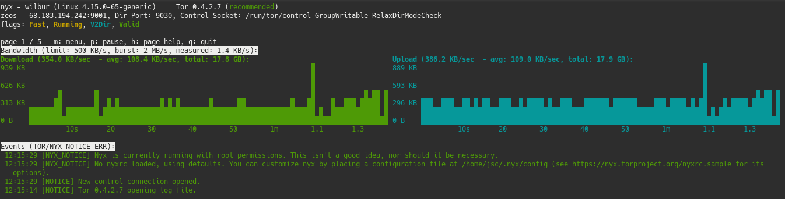

I'm a huge fan of both privacy and cool technology, so it goes without saying that I'm also a huge fan of [the Tor Project](https://torproject.org).

> Tor is free and open-source software for enabling anonymous communication. The name is derived from an acronym for the original software project name "The Onion Router". Tor directs Internet traffic through a free, worldwide, volunteer overlay network consisting of more than seven thousand relays to conceal a user's location and usage from anyone conducting network surveillance or traffic analysis.

Tor works by routing your heavily encrypted traffic through a random selection of Tor relays.  Each relay peels off a layer of encryption (hence the onion thing) and then passes it on to the next relay before it eventually connects to the target site.  The data being returned to you takes a similar path with similar layered encryption.  The cool thing is that, unlike VPN providers, none of the Tor relays have enough information to answer the questions: a) who you are, b) what you are connecting to / doing.  This makes it a far more anonymous system than most VPN providers which require you to trust the VPN operator (who certainly can monitor your traffic and who definitely knows who you are).



The strength (and speed) of the Tor network is dependent on the relays which are those machines which pass your data around.  The more relays there are run by different people, the less likely it is that the random path your data takes is going through a path operated by a single entity who would then be able to deanonymize you (since they can follow your data through each hop).

In occurred to me that I have a fairly beefy server that's primarily serving this blog (static pages, yay!).  It is extremely underutilized, so I decided to install Tor and set it up as a relay.

## Installing Tor

My server is running Ubuntu 18.04.  The Tor package that is in the Ubuntu repositories is super old so it's necessary to pull in the Tor repositories instead.

```
$ sudo apt install apt-transport-https
$ echo "deb https://deb.torproject.org/torproject.org/ $(lsb_release -cs) main" | sudo tee /etc/apt/sources.list.d/tor.list
$ echo "deb-src https://deb.torproject.org/torproject.org/ $(lsb_release -cs) main" | sudo tee /etc/apt/sources.list.d/tor.list
$ wget -qO- https://deb.torproject.org/torproject.org/A3C4F0F979CAA22CDBA8F512EE8CBC9E886DDD89.asc | sudo apt-key add -
$ apt update
$ apt install nyx tor deb.torproject.org-keyring
```

## Configuring Tor as a Relay

Once the software is installed, the Tor service is configured via. `/etc/tor/torrc`.

{}
Tor relays can be configured as *exit nodes*.  Exit nodes are the final hop on the Tor network before your traffic reenters the normal Internet.  Running an Exit node can be dangerous because a lot of sketchy stuff happens on the Tor network and I'd rather not be the one that site operators come back to as the source for that sketchy stuff hitting their server.  Adding `ExitRelay 0` to the `torrc` ensures that my Tor relay is not an exit node.
{}

My bandwidth cap is 1TB / month which, if my math is correct, gives me about 400,000 Bytes/sec sustained.  Outside of Tor, the traffic to this server per month is negligible. 

Here is my sample `/etc/tor/torrc` file.

```
Log notice file /var/log/tor/notices.log
ORPort 9001
DirPort 9030 # what port to advertise for directory connections
Address wilbur.erraticbits.ca # hostname for this server
Nickname erraticbits # nickname for this server in directory
RelayBandwidthRate 400 KBytes  # Throttle traffic to 400KB/s (approx 1TB / mo)
RelayBandwidthBurst 1000 KBytes # But allow bursts up to 1000KB 
ContactInfo 0x063B48690F1D6F12 Tor Admin <tor@erraticbits.ca>
ExitRelay 0
```

Once the configuration updates are made, restart Tor with:

```
$ systemctl tor restart
```

Once it's up and running...

There is a pretty cool tool called Nyx that you can run on the Tor node that shows real-time usage and log messages.  Like so:

```
$ sudo -u debian-tor nyx
```



The Tor Project also has a stats page that shows the status in the Tor network, and utilization.  Here is [mine](https://metrics.torproject.org/rs.html#details/31A97198C6E2BEBF57EB8FC7DC55A208AD35038E).

Et. voila.  Now my idle bandwidth is helping make the Internet a more anonymous place.