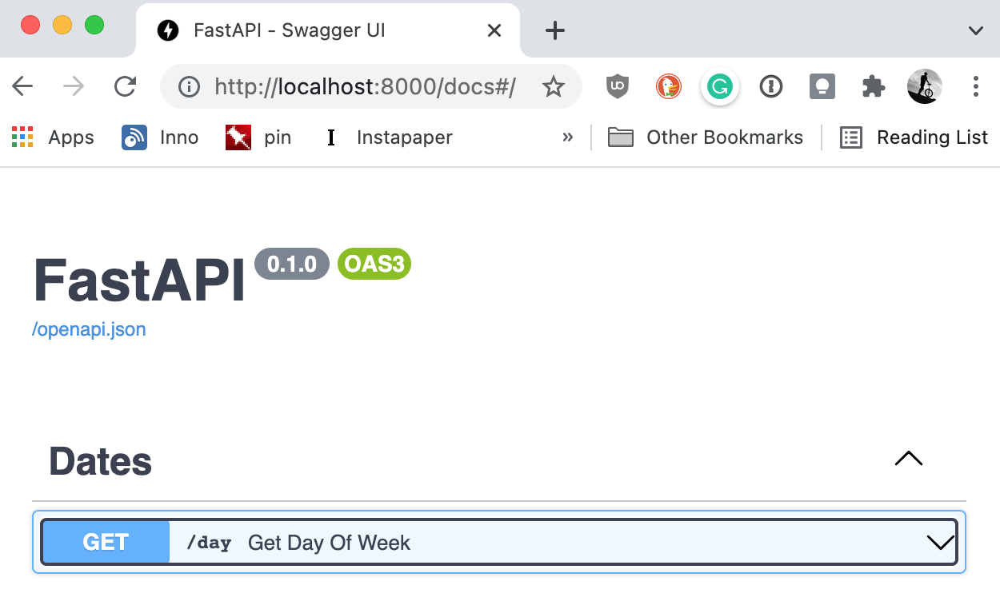
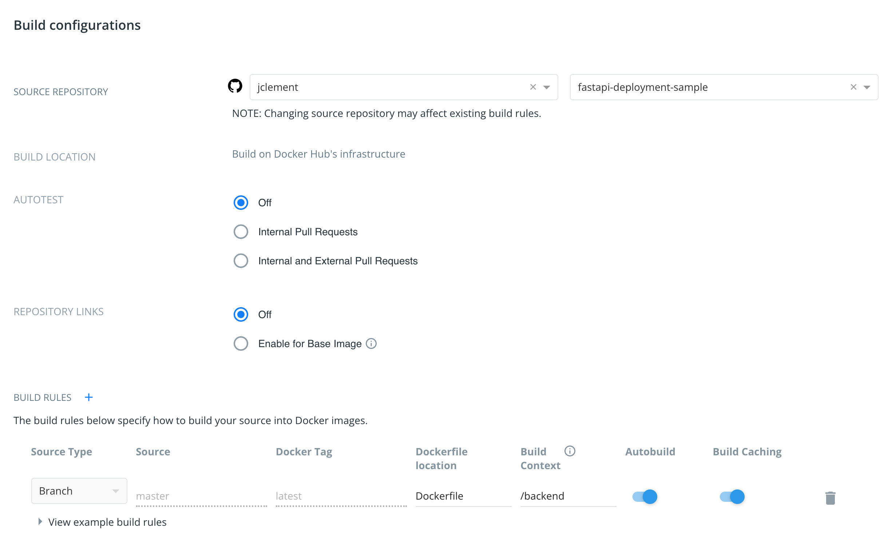

I've recently been working on a fun Advent of Code project for work and using some new (to me) technologies like [FastAPI](https://fastapi.tiangolo.com/) and Docker for deployment.  This post is a simplification of the project structure and deployment configuration I used (mostly as a reference for future me, but perhaps someone else will find it useful too).  The focus is on project structure and deployment.  This is not intended to be an interesting sample project for FastAPI or React.

See the [full project on Github](https://github.com/jclement/fastapi-deployment-sample).

The overall project structure looks like so:

```text
.
├── Caddyfile
├── README.md
├── venv
├── backend
│   ├── Dockerfile
│   ├── app
│   │   └── main.py
│   └── requirements.txt
├── docker-compose.yml
└── frontend
    ├── Dockerfile
    ├── package.json
    └── src
        ├── App.js
        └── setupProxy.js
```

## A Basic Fast API Server

The server component is written using [FastAPI](https://fastapi.tiangolo.com/).  

I picked FastAPI for several reasons:

1. **Python-based.** It's been a while since I've used Python for anything and wanted to refresh my skills.
2. **Simple.**  Writing APIs in FastAPI is crazy efficient.
3. **Documentation.**  The majority of the UI work for this project is being done by someone else.  I wanted Swagger-type documentation for the APIs I created and FastAPI does that out-of-the-box.

In the project root I created a new Python 3 virtual environment (FastAPI requires Python 3, and honestly Python 3 has been a thing for the while now).

```sh
python3 -m venv venv
. venv/bin/activate   
# venv\scripts\activate on Windows
```

I've broken the project structure into `frontend` and `backend` folders, so let's start with `backend`.

Create a `backend/requirements.txt` with the required modules for FastAPI.

```text
fastapi
uvicorn
```

And, install those requirements.
```sh
pip install -r backend/requirements.txt
```

Now, to create a really dumb FastAPI server.  Here is `backend/app/main.py`.

```python
from fastapi import FastAPI
from datetime import datetime

app = FastAPI()

@app.get("/day", tags=["Dates"])
def get_day_of_week():
    """
    Get the current day of week
    """
    return datetime.now().strftime("%A")
```

Now, from the `backend` folder we can run our FastAPI service:

```sh
cd backend
uvicorn app.main:app --reload
```

If you visit `http://localhost:8000/docs` you can inspect/test the new day of week API.



## A Basic React APP

Now to build a basic frontend app in React that calls the new API.  For this, I used [Create React App](https://create-react-app.dev/).

Assuming you already have a modern version of NodeJS installed, from the Project root...

```sh
npx create-react-app frontend
```

CreateReactApp creates a handy development server that serves the front-end application.  

When I deploy this for real, I want everything to be housed under a single server with my APIs namespaced to `/api` so that I can make API calls to `/api/day` from my frontend code.  To do this in development, we need to configure the React development server to proxy requests through to the FastAPI development server.

The built-in proxy functionality in CreateReactApp doesn't support this URL tampering so we need to do that ourselves.

First, install the `http-proxy-middleware` with NPM.

```sh
cd frontend
npm install --save http-proxy-middleware
```

Next, create `frontend/src/setupProxy.js` and have it proxy requests to `/api` through to the FastAPI development server (stripping the `/api` prefix).

```js
const { createProxyMiddleware } = require('http-proxy-middleware');

module.exports = function(app) {
  app.use(
    '/api',
    createProxyMiddleware({
      target: 'http://localhost:8000',
      changeOrigin: true,
      pathRewrite: {'^/api' : ''}
    })
  );
};
```

Now, we can replace `frontend/src/App.js` and call our new API to print out the current day of the week.

```react
import React from 'react';

class App extends React.Component {

  constructor(props) {
    super(props);
    this.state = {
        day: ""
    };
  }

  componentDidMount() {
      fetch('/api/day')
          .then(response => response.json())
          .then(response => this.setState({'day': response.day}))
  }

  render() {
    return <h1>Hey!  It's {this.state.day}</h1>;
  }

}

export default App;
```

Make sure FastAPI service is running (port 8000) and start the front-end development service.

```sh
cd frontend
npm start
```

If you visit `http://localhost:3000` you should see something like:

> Hey!   It's Saturday.

## Dockerizing the Server

Dockerizing the FastAPI backend is fairly easy.  

Create `backend/Dockerfile`

```dockerfile
FROM python:3.9
WORKDIR /code
ENV PYTHONDONTWRITEBYTECODE 1
ENV PYTHONBUFFERED 1
COPY ./requirements.txt /code/requirements.txt
RUN pip install --no-cache-dir --upgrade -r /code/requirements.txt
COPY ./app /code/app
EXPOSE 8000
CMD ["uvicorn", "app.main:app", "--host", "0.0.0.0", "--port", "8000"]
```

You can test it builds with:

```sh
cd backend
Docker build .
```

## Dockerizing the Frontend

Dockerizing the frontend is a bit more complex since it has several parts:

1. Build a production version of the React app (a bunch of static files)
2. Fire up a HTTP server of some sort to serve those static files. 
3. Proxy requests to `/api` through to my FastAPI container
4. Oh.  And obtain some SSL certificates while we're at it.

Create `frontend/Dockerfile`

```dockerfile
# Build step #1: build the React front end
FROM node:lts-alpine as build-step
WORKDIR /app
ENV PATH /app/node_modules/.bin:$PATH
COPY package.json  ./
COPY ./src ./src
COPY ./public ./public
RUN npm install
RUN npm run build

# Build step #2: build an Caddy container
FROM caddy:alpine
EXPOSE 80
EXPOSE 443
COPY --from=build-step /app/build /usr/share/caddy
```

You can test it builds with:

```sh
cd frontend
Docker build .
```

## Using *docker-compose* to test it locally

Create `Caddyfile` with the configuration for Caddy (the webserver).  In this case, we're only binding to port 80 (so no HTTPS).  All requests to `/api` are proxied through to the *backend* container.

```caddy
:80

handle_path /api/* {
	reverse_proxy backend:8000 {
        header_up Host {upstream_hostport}
        header_up X-Real-IP {remote_addr}
        header_up X-Forwarded-Host {host}
    }
}

handle {
        root * /usr/share/caddy/
        try_files {path} {file} /index.html
        file_server
}
```

Then create `docker-compose.yml` to wire this stuff together.
```docker
version: '3.8'

services:

  backend:
    build: ./backend
    command: uvicorn app.main:app --root-path /api --proxy-headers --host 0.0.0.0 --port 8000

  frontend:
    build: ./frontend
    ports:
      - "8080:80"
    volumes:
      - ./Caddyfile:/etc/caddy/Caddyfile
      - caddy-data:/data
      - caddy-config:/config
    depends_on:
      - backend

volumes:
  caddy-data:
  caddy-config:
```

{}
The `--root-path /api` gives FastAPI a hint that it's running behind a proxy so that the documentation works properly when accessed via. `/api/docs/`
{}

At this point you should be able to run `docker-compose up` and get a running service listening on port 8080.

## Automating Docker Image Builds

Once the above is done and checked into a repo on GitHub, we can configure DockerHub to automatically build new images when the code changes.

On DockerHub create a two new repositories.  One for `-backend` and one for `-frontend`.  On the *Build* tab for each of the new repositories click *Configure Automated Builds*.

* Link it to the Github repository with the project in it
* Ensure the Build Context is updated to `/frontend` or `/backend` as appropriate to ensure we're building the right Dockerfile for each image.



## Production Deployment

On a new VM with Docker and `docker-compose` deployed, let's configure this to work for real (I'm using the domain `demo.erraticbits.ca` for this...)

Create `/docker/demo/docker-compose.yml` as:

```docker
version: '3.8'

services:

  backend:
    image: index.docker.io/jclement/fastapi-deployment-sample-backend:latest
    restart: always
    command: uvicorn app.main:app --root-path /api --proxy-headers --host 0.0.0.0 --port 8000

  frontend:
    image: index.docker.io/jclement/fastapi-deployment-sample-frontend:latest
    restart: always
    ports:
      - "80:80"
      - "443:443"
    volumes:
      - ./Caddyfile:/etc/caddy/Caddyfile
      - caddy-data:/data
      - caddy-config:/config
    depends_on:
      - backend

volumes:
  caddy-data:
  caddy-config:
```

{}
We've replaced the *build* lines with *image* so that we're using the images on DockerHub rather than building them locally. We've added `restart: always` to ensure this starts on system boot We've exposed port 80 and 443 so that TLS works properly
{}

Create `/docker/demo/Caddyfile` as:

```caddyfile
demo.erraticbits.ca

handle_path /api/* {
	reverse_proxy backend:8000 {
        header_up Host {upstream_hostport}
        header_up X-Real-IP {remote_addr}
        header_up X-Forwarded-Host {host}
    }
}

handle {
        root * /usr/share/caddy/
        try_files {path} {file} /index.html
        file_server
}
```

If you are running at the top-level of the domain and want to redirect to `www`, it would look more like this:

```caddyfile
www.erraticbits.ca {
        root * /usr/share/caddy/
        file_server browse

        handle_path /api/* {
                reverse_proxy backend:8000 {
                header_up Host {upstream_hostport}
                header_up X-Real-IP {remote_addr}
                header_up X-Forwarded-Host {host}
            }
        }

        handle {
                root * /usr/share/caddy/
                try_files {path} {file} /index.html
                file_server
        }
}

erraticbits.ca {
        redir https://www.erraticbits.ca{uri}
}
```

And start up the *frontend* and *backend* services with this:

```sh
cd /docker/demo
docker-compose up -d
```

## Automated Docker Updates

We can then use [Watchtower](https://containrrr.dev/watchtower/) to automagically (every 180 seconds) keep our Docker images up-to-date when the images change on DockerHub.

Create `/docker/watchtower/docker-compose.yml` as:

```docker
version: "3"
services:
  watchtower:
    restart: always
    image: containrrr/watchtower
    volumes:
      - /var/run/docker.sock:/var/run/docker.sock
    command: --interval 180
```

And start the Watchtower container.

```sh
cd /docker/watchtower
docker-compose up -d
```

For private docker repositories it's a bit more complicated:
1. Login using `docker login` 
2. Pass the `$HOME/.docker/config.json` file into watchtower by adding a volume in the `docker-compose` file for watchtower: 
```docker
    volumes:
      - /var/run/docker.sock:/var/run/docker.sock
      - /root/.docker/config.json:/config.json
```
3. If using Docker Hub, ensure that the images have the full page to the image (`index.docker.io/jclement/fastapi-...` rather than `jclement/fastapi-...`) or you'll get authentication errors

## Summary

And that's it for a super high-level overview of building a basic application with FastAPI and CreateReactApp, and then deploying it via. Docker in a reasonably automated way.