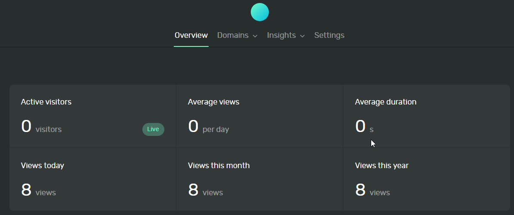


Ever since I moved away from platforms like Wordpress and Google Analytics, I've had limited visibility into usage of this website.  How many visitors do I get?  Which articles do people actually read?  I have no idea!


It's a problem I haven't been particularly invested in fixing.  

* I don't want to hand over usage information to some free 3rd party who is going to mine that data for some nefarious purpose.
* It's not an important enough problem for me to pay a 3rd party to solve (with the naive assumption that a paid service wouldn't exploit my data).
* It's not an important enough problem for me to invest significant time into.

Yesterday, however, I came across [Ackee](https://ackee.electerious.com/) which brilliantly fills this gap for me.

> Self-hosted, Node.js based analytics tool for those who care about privacy. Ackee runs on your own server, analyzes the traffic of your websites and provides useful statistics in a minimal interface.

Here are some quick notes on what I went through to deploy this and integrate it with this website.

The end result is a nice visualization of usage information of my various websites without horribly compromising the privacy of my visitors.  I haven't been using it long, but it looks like I'll eventually see trends identified in its output too!



I use Docker (compose) and Traefik ([my setup]()) in my environment, so I started with `docker-compose.yml` file from the [Docker Compose Getting Started Documentation](https://docs.ackee.electerious.com/#/docs/Get%20started#with-docker-compose).

I updated my DNS to point `ackee.erraticbits.ca` to my server.

I needed to add the usual Traefik labels/net to my `docker-compose.yml`.  In addition, I had to add some additional CORS headers to allow calls from my various websites.


Make sure to update the username and password on lines 10-11.



version: "2"

services:
  ackee:
    image: electerious/ackee
    restart: always
    environment:
      - WAIT_HOSTS=mongo:27017
      - ACKEE_MONGODB=mongodb://mongo:27017/ackee
      - ACKEE_USERNAME=admin
      - ACKEE_PASSWORD=...
    depends_on:
      - mongo
    labels:
      - "traefik.enable=true"
      - "traefik.docker.network=traefik_net"
      - "traefik.http.routers.ackee.entrypoints=websecure"
      - "traefik.http.routers.ackee.rule=Host(`ackee.erraticbits.ca`)"
      - "traefik.http.routers.ackee.tls.certresolver=lets-encr"
      - "traefik.http.routers.ackee.middlewares=ackee-cors@docker"
      - "traefik.http.middlewares.ackee-cors.headers.accesscontrolallowmethods=GET,POST,PATCH,OPTIONS"
      - "traefik.http.middlewares.ackee-cors.headers.accesscontrolallowheaders=Content-Type"
      - "traefik.http.middlewares.ackee-cors.headers.accesscontrolalloworiginlist=https://www.erraticbits.ca,https://www.example2.com"
      - "traefik.http.middlewares.ackee-cors.headers.accesscontrolallowcredentials=True"
    networks:
      - traefik_net
      - backend

  mongo:
    image: mongo
    restart: always
    volumes:
      - data:/data/db
    networks:
      - backend

volumes:
  data:

networks:
  backend:
  traefik_net:
    external: true


Start it up:

```
$ docker-compose up -d
```

Once it's up and running, I can visit `https://ackee.erraticbits.ca` and login with the username and password from the `docker-compose.yml` file.

Adding analytics to the site is trivial.  Just click "Settings" and "New Domain".  



Once the new domain has been added, click on it and copy the "Embed Code" and paste that into your webpage template.



That's it.  The only problematic part for me was getting the CORS headers configured correctly.


