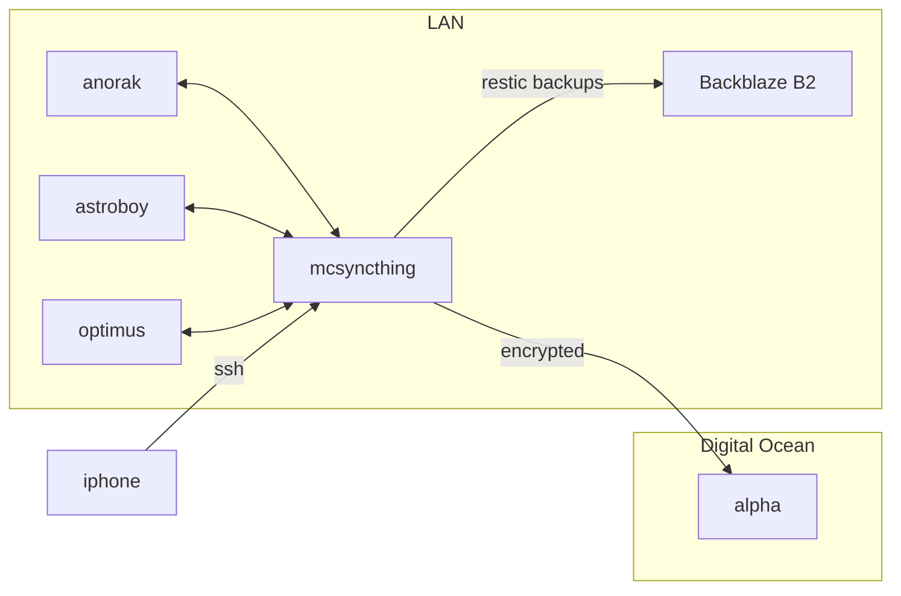
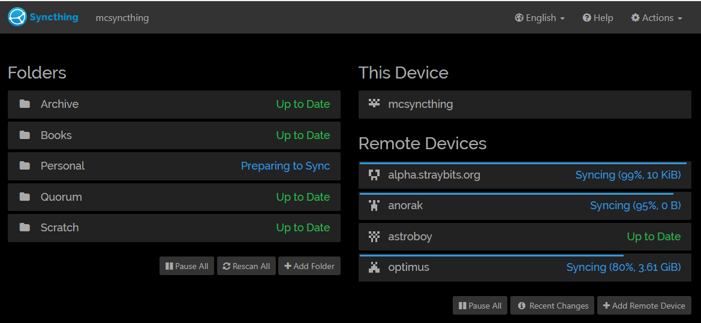

Every six months or so, when the position of the moon is just right, I flip-flop on the privacy/self-hosted vs. just-let-Google-handle-it issue.  Today, I've flopped toward privacy and self-hosting.

A couple of days ago, I was using Gmail for the majority of my email and Google Drive for syncing files between my various machines (Windows desktop, Windows laptop, MacbookPro, Chromebook, and iPhone).

This post is mostly focused on my migration from Google Drive to [SyncThing](https://www.syncthing.net), but I'll touch on what I did with email too.

# Quick Thoughts on Email

A quick note about email...  While not the focus of this post, I also migrated my email from Google Mail to FastMail.  The other options I considered were [Protonmail](https://www.protonmail.com), and self-hosting with [Mail-in-a-Box](https://https://mailinabox.email/).

* Protonmail has built in GPG encryption.  While this seems cool, I don't like them managing the keys for me.  I strongly prefer my GnuPG keys on a smartcard.  You can use Thunderbird + Protonmail bridge to accomplish this, but it creates some weird bevaviour because you have two keys (the Protonmail one, and the smartcard one).
* Protonmail's calendar and contact management is poor and slow.
* Protonmail requires the use of their app on mobile devices.  Their app is... poor.
* I'm uncomfortable with making my primary email address a commercial one (i.e. outlook.com or gmail.com) because I become hostage to that platform.
* Mail-in-a-box makes it super easy to setup a self-hosted mail server.  Unfortunately, it's getting really difficult to find a VPS whose IP range isn't blacklisted, so I suffered from intermittent delivery problems.  In addition, mail is important.  I think a competent mail provider is probably better at security than I am.

Fastmail is beautiful and blazingly fast.  It supports adding your own domains.  It has calendar and contacts.  It integrates with native apps nicely.  It even support MaskedEmails (randomly generated disposable email addresses).  It even has a great iOS app.

So... I migrated from Google Mail to Fastmail and, thanks to their migration tool, it turned out that was about 2 minutes of effort.  Neat!

# File Syncing

The primary focus of this post is my approach to syncing files between my various devices.

Up until yesterday, my files were stored in Google Drive, with more sensitive files stored in a [Cryptomator](https://cryptomator.org) vault within Google Drive. 

I wanted to move to something self-hosted, where my **unencrypted data doesn't get stored on computers that I don't manage**.  In the past, I've tried NextCloud for this, but I've frequently run into issues with automatic upgrades failing and the sync client getting stuck in a broken state and failing.

It turns out I rarely need the file sharing capabilities of Google Drive and, when I do, I use my personal instance of [transfer.sh](https://www.transfer.sh).

So... Today's solution is the peer-to-peer syncing client SyncThing.

<p>My high-level requirements:
<ul>
<li> Make sure my files are available on all my machines</li>
<li> Make sure I can access my files on my iPhone (there is no iPhone app for SyncThing)</li>
<li> Make sure my files are all backed up somewhere (ideally, several places)</li>
</ul>
</p>

While I can install SyncThing on each of my workstations (anorak, astroboy and optimus), it doesn't help with my iPhone (no SyncThing support), and it makes for a messy backup solution (where do I run backups from?).

What I ended up doing was repurposing a RaspberryPi 4 as my dedicated SyncThing "coordinator" (I called it *mcsyncthing*).

1. Each workstation's instance of SyncThing is connected to *mcsyncthing*.
2. *mcsyncthing* is configured as an "introducer", so the workstations will discovered additional devices through *mcsyncthing*
3. New folders are initiated on *mcsyncthing* and shared to the appropriate machines from there.
4. I use [restic](https://restic.net/) on *mcsyncthing* to take hourly backups and store those on Backblaze B2.
5. I use the [shellfish](https://shellfishapp.com/) app on my iPhone to SSH into mcsyncthing and access my files (shellfish even supports Files App integration).

I am also running SyncThing on one of my cloud-hosted servers (alpha, in the diagram below), and this is connected to *mcsyncthing* too.  This cloud machine is marked as "untrusted" so *mcsyncthing* will only backup encrypted data to that machine, making it a useful machine for additional redundancy (without exposing my data).  I have limited storage on this cloud machine, so I instruct *mcsyncthing* to sync only my most important folders to that machine.

The whole picture looks like this:



Although, it's actually more like this because the individual workstations will sync between themselves too.

```mermaid
flowchart LR
 subgraph LAN
 anorak<-->mcsyncthing
 astroboy<-->mcsyncthing
 optimus<-->mcsyncthing
 anorak<-->astroboy
 anorak<-->optimus
  astroboy<-->optimus
 mcsyncthing--restic backups-->b2[Backblaze B2]
 end 
 subgraph Digital Ocean
 mcsyncthing--encrypted-->alpha
 end
 iphone--ssh-->mcsyncthing
 ```

Quick screenshot of the management UI for SyncThing on *mcsyncthing* that I connect to via. an SSH Tunnel.
 
 

 The end result is pretty cool:
 
 1. My important files are magically sync'd between my machines.
 2. Because I've broken my data into multiple folders, I can control which machines get which data and avoid filling up the smaller drives on my laptops with data I don't need on those devices.
 3. My files are never stored unencrypted on machines I don't own.
 4. I can seamlessly access my files from my iPhone (read and upload) via SSH.  For that matter, I can access my files via SSH from anywhere else using my Yubikey.
 5. The whole system can tolerate outages of any machine without failing (other than the iPhone access does required *mcsyncthing* to be available)
 6. I have hourly offsite / encrypted backups.
 7. Lots of redundancy:
     * Files are backed up in B2
     * Files are replicated on each workstation
     * I can configure individual workstations (those with more storage) to store file history
