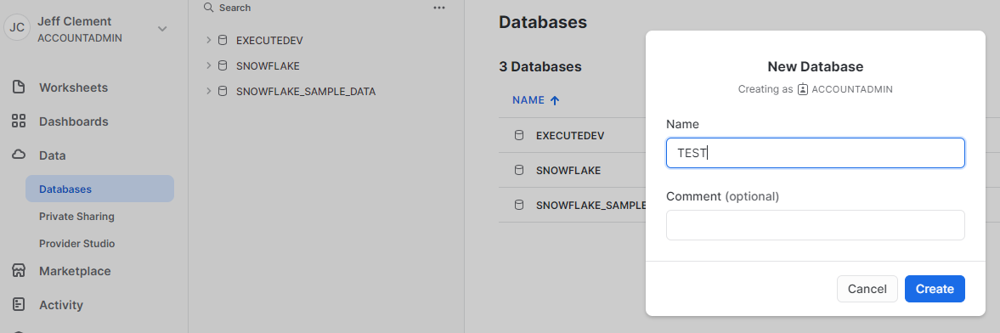
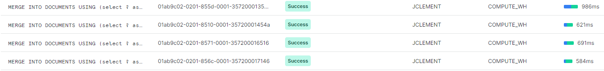
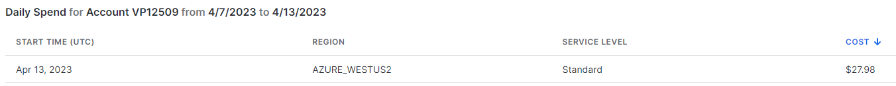
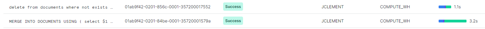
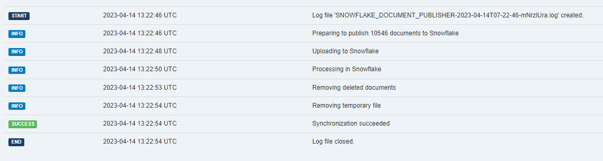
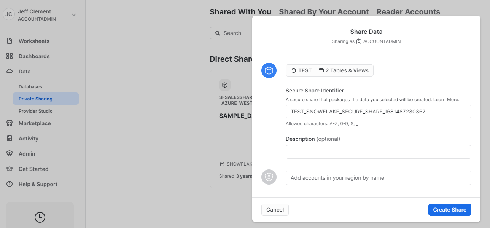

In my day job, I work on workflow/data management-type software (B2B). Our software captures data (via. fancy workflow tooling) in a structure we creatively call "Documents".  A "Document" is just a big collection of fields (text, integer, dates, tables, references to other documents, etc.). Our app was historically deployed on-prem, where customers had direct access to the underlying database and could build integrations and run reports at the database level.  As more of our customers shift to SaaS, this direct-database approach isn't available.

I wanted to look into Snowflake as a mechanism to share near-realtime data with our customers for their reporting / consumption.

1. MANY of our customers have already settled on Snowflake as their data warehouse tooling of choice.  MANY of them are asking for this very thing.
2. Snowflake has an interesting split between data storage and computation.  Theoretically, we could post data to our Snowflake environment, and then securely share it with customers (via. a Private Share) to give access. This is very elegant and several other vendors in our space are doing this very thing.
3. Snowflake can behave like a big-ol SQL database.  This makes adoption easier since ALL of our customers of SQL ninjas. While we do have great OData end-points and APIs, these require different tooling and skillsets.

My starting thought was to hook into our events mechanism and push the document (as JSON) directly into a table on Snowflake, and then rely on Snowflake's ability to query and build views on JSON data to explode that out into user friendly views as required.  This seemed reasonable because:

1. Our software doesn't deal with huge volumes of records.  A large customer will probably have < 1M "Documents".  
2. Our "Documents" serialize well to JSON.
3. Our software provides a great deal of configurability where customers can add user-defined fields at will. At the database schema level, we do this by actually altering tables and adding columns on demand. Doing any sort of table-based syncing approach seemed like we'd likely run into hiccups because of this ever evolving schema.  


graph TB
 subgraph Our Snowflake
  Documents
  View1
  View2
end
 subgraph Customer Snowflake
  CView1[View1]
  CView2[View2]
end
 App--Publish JSON-->Documents[Document Table]
 View1--Read-->Documents
 View2--Read-->Documents
View1--Share-->CView1
View2--Share-->CView2


## Initial Setup

Initially, I signed up for a trial account with Snowflake and created a new database called "TEST".



I created a new DOCUMENTS table to house the incoming data.

```sql
use schema public;
create or replace TABLE DOCUMENTS (
	TYPE VARCHAR(50) NOT NULL,
	ID VARCHAR(50) NOT NULL,
	VERSION NUMBER(38,0) NOT NULL,
	DATA VARIANT NOT NULL,
	constraint DOCUMENTS_PL primary key (TYPE, ID, VERSION)
);
```

* **TYPE** is the type of the document being stored. We have many different document types (USERS, PARTNERS, ACCOUNTS, ...)
* **ID** is the ID of the document being stored
* **VERSION** is the version of the document being stored. We have strong versioning in our application so every update is a new version, and any historic version is immutable.  Rather than only store the latest version in Snowflake, I figured we may as well store every version we encounter along the way and open up some cool reporting opportunities.
* **DATA** is the serialized JSON payload of the document itself.  (I'm told that querying JOSN in VARIANT columns performs fairly close to individual columns).

I wrote a quick serializer to convert our Document into some nice looking JSON.  Here is a somewhat simple example, with some custom fields and even a custom "CONTRACTS" table.

```json
{
  "ACTIVE": true,
  "COMNAME": "Test Company",
  "CUSTOM": {
    "CONTACT_EMAIL": "bob@mcgee.coim",
    "CONTACT_NAME": "Bob McGee",
    "CONTRACTS": [
      {
        "CONTRACT_DESCRIPTION": "A contract",
        "CONTRACT_NUMBER": "123",
        "EFFECTIVE_DATE": "2023-04-01T06:00:00Z",
        "LISTITEM_ID": "a508cbcc-7682-4523-ae5d-e0abdb8d240c"
      },
      {
        "CONTRACT_DESCRIPTION": "Another one",
        "CONTRACT_NUMBER": "456",
        "EFFECTIVE_DATE": "2023-04-21T06:00:00Z",
        "LISTITEM_ID": "ce60a127-8888-43ec-b6fd-bfc981e9f867"
      }
    ],
    "ISACTIVE": true
  },
  "DOCUMENT_ID": "49a3ef49-8790-45d6-bd73-2a1451ce41f0",
}
```

I installed the [Snowflake Connector for .NET](https://github.com/snowflakedb/snowflake-connector-net) via. NPM, and was able to open a connection to Snowflake with the following:

```csharp
private SnowflakeDbConnection CreateConnection()
{
    var connection = new SnowflakeDbConnection();
    connection.ConnectionString = "account=;user=;password=;db=;schema=;warehouse=";
    connection.Open();
    return connection;
}
```

The connection string is composed of:
* **account** can be found under `Admin\Accounts` and is of the form "{organization}-{account}"
* **user** is the username of my Snowflake account
* **password** is obvious :)
* **db** would be the name of my Snowflake database I'm connecting to (TEST in this case)
* **schema** would be the default schema to use (I'm just using PUBLIC)
* **warehouse** is the name of the Snowflake warehouse that will be doing the processing (found on `Admin\Warehouses`)

Once connected, I can easily run queries against Snowflake.

The next step is to start pushing near-realtime document update events into Snowflake (adding rows to the DOCUMENTS table), as well as initial seeding of that table with historical data.

## Approach 1: SQL Updates

My first approach was to treat this thing like a big 'ol database and do normal SQL insert/update statements.

I wrote the following Publish method that would push a document up into Snowflake.  I used `MERGE INTO` so that it would correctly update a record if it already happened to exist.

Note: the JSON is being passed into the query as a string, and I'm parsing it in `parse_json` prior to stuffing it into the DOCUMENTS table.

```csharp
private void Publish(SnowflakeDbConnection connection, Document document)
{
    var command = connection.CreateCommand();

    command.CommandText = $@"
MERGE INTO DOCUMENTS
USING (select ? as type,? as id,? as version, parse_json(?) as data) s
ON DOCUMENTS.type = s.type and DOCUMENTS.id = s.id and DOCUMENTS.VERSION = s.version
WHEN MATCHED THEN
UPDATE set data = s.data
WHEN NOT MATCHED THEN
INSERT (type, id, version, data) values (s.type, s.id, s.version, s.data);
";
    
    var p1 = command.CreateParameter();
    p1.ParameterName = "1";
    p1.Value = document.Type;
    p1.DbType = DbType.String;
    command.Parameters.Add(p1);

    var p2 = command.CreateParameter();
    p2.ParameterName = "2";
    p2.Value = document.Id;
    p2.DbType = DbType.String;
    command.Parameters.Add(p2);

    var p3 = command.CreateParameter();
    p3.ParameterName = "3";
    p3.Value = document.Version;
    p3.DbType = DbType.String;
    command.Parameters.Add(p3);

    var p4 = command.CreateParameter();
    p4.ParameterName = "4";
    p4.Value = m_simpleJsonSerializer.Serialize(document);
    p4.DbType = DbType.String;
    command.Parameters.Add(p4);

    command.ExecuteNonQuery();

}
```

I called the above each time the document was updated on our side and it would insert/update rows into the DOCUMENTS table as you'd expect. 

Unfortunately, it was rather slow (as advertised... Snowflake doesn't recommend doing many individual updates like this).  As you can see from this screenshot of the Snowflake warehouse usage screen, it's taking 500ms+ for each upsert.



This slowness is even more of an issue given my initial simplistic approach to backfilling historical data.

```csharp
private void PublishAll(SnowflakeDbConnection connection)
{
    
    foreach(var doc in m_documentRepository.ListAll()) {
        Publish(connection, doc);
    }

}
```

In my test environment with roughly 10k documents, this was initiating 10k upsert calls and took roughly 80 minutes to Execute.  This is problematic because 10k is a small number of documents.  In real world use, this would be much too slow.  Also, you pay for compute time in Snowflake warehouses...



My brief experiments were fairly expensive.  In addition, because the update events were real-time, there is no opportunity for the warehouse to automatically spin down and save money.

## Approach 2: Batch Updates

My second approach was to upload the data to Snowflake in a CSV and process it in batch.  I would use the same approach for the initial load (one giant CSV with everything... why not?!) and for subsequent updates (all documents updated since the last partial update).

For this, I needed to create a "stage" (Snowflake receptacle for file uploads) to upload the CSV.  The following declares the format for my CSV (skip the header row, fields enclosed in quotes), and then creates a stage "DOCUMENT_STAGE" pre-configured with that format.

```sql
use schema public;
create or replace file format csv_format TYPE = CSV SKIP_HEADER=1 TRIM_SPACE=true FIELD_OPTIONALLY_ENCLOSED_BY = '"';
create or replace stage DOCUMENTS_STAGE file_format = 'csv_format';
```

It turns out that uploading CSV data using the SQL connector is easy:

```sql
PUT file://c:/temp/test.csv @DOCUMENTS_STAGE
```

And once uploaded, you can query that staged file fairly easily.  Sick!

```sql
SELECT $1, $2, $3, $4 FROM @public.DOCUMENTS_STAGE/test.csv
```

Now I can bulk merge the data in my staged file into my DOCUMENTS table with something like:

```sql
MERGE INTO DOCUMENTS
USING (
select $1 type, $2 id,  $3::integer version,parse_json($4) as data from @DOCUMENTS_STAGE/test.csv.gz 
) s
ON DOCUMENTS.type = s.type and DOCUMENTS.id = s.id and DOCUMENTS.VERSION = s.version
WHEN MATCHED THEN
UPDATE set data = s.data
WHEN NOT MATCHED THEN
INSERT (type, id, version, data) values (s.type, s.id, s.version, s.data);
```

With this new super-power, I revised my Publish method to take a list of documents, rather than a single one.

* On initial load / bootstrap this would be a list of all documents in the system
* On updates, it's a list of documents that were modified since the last full sync (code for that isn't included in this post).  The interval is configurable so you can adjust the balance between realtime and cost.
* I added a "completeSync" parameter which indicates that the dataset being provided is the full list of documents.  When "completeSync" is set, I clear out any records in Snowflake that are no longer in the source system. I normally handle deletes in near-realtime (outside the scope of this article) but this is a safety net where I can run the full sync at some later time and be sure everything will be fixed up if some individual events were lost.

```csharp
private void Publish(SnowflakeDbConnection connection, IEnumerable<Document> documents, bool completeSync)
{
    var fn = "upload.csv";
    var path = Path.Combine(Path.GetTempPath(), fn);
    var uri = new Uri(path).AbsoluteUri.Replace("file:///", "file://"); // HACK: snowflake doesn't like file:/// in URI

    //logger?.Info($"Preparing to publish {documents.Count()} documents to Snowflake");
    using (var writer = new StreamWriter(path))
    {
        using (var csv = new CsvWriter(writer, CultureInfo.InvariantCulture))
        {
            csv.WriteHeader<CsvRow>();
            csv.NextRecord();
            foreach (var doc in documents)
            {
                csv.WriteRecord(new CsvRow()
                {
                    Type = doc.Type,
                    Id = doc.Id,
                    Version = doc.Version,
                    Data = m_simpleJsonSerializer.Serialize(doc)
                });
                csv.NextRecord();
            }
        }
    }

    //logger?.Info($"Uploading to Snowflake");
    var c = connection.CreateCommand();
    c.CommandText = $"PUT {uri} @DOCUMENTS_STAGE";
    c.ExecuteNonQuery();

    //logger?.Info($"Processing in Snowflake");
    c.CommandText = $@"
MERGE INTO DOCUMENTS
USING (
select $1 type, $2 id,  $3::integer version,parse_json($4) as data from @DOCUMENTS_STAGE/{fn}.gz 
) s
ON DOCUMENTS.type = s.type and DOCUMENTS.id = s.id and DOCUMENTS.VERSION = s.version
WHEN MATCHED THEN
UPDATE set data = s.data
WHEN NOT MATCHED THEN
INSERT (type, id, version, data) values (s.type, s.id, s.version, s.data);";
    c.ExecuteNonQuery();

    if (completeSync)
    {
        //logger?.Info($"Removing deleted documents");
        c.CommandText = @$"delete from DOCUMENTS where not exists (select 1 from @DOCUMENTS_STAGE/{fn}.gz d where d.$1 = DOCUMENTS.type and d.$2=DOCUMENTS.id);";
        c.ExecuteNonQuery();
    } 

    //logger?.Info($"Removing temporary file");
    c.CommandText = $"remove @DOCUMENTS_STAGE/{fn}.gz";
    c.ExecuteNonQuery();
    File.Delete(path);
}
```

Now things get impressive.  For a full sync of my 10k document test set, I generate a roughly 40M CSV. Snowflake automatically gzips that CSV on upload, so the upload size is only about 4M (making for a speedy upload).

Merging data from the staged file into the DOCUMENTS table only took 3 seconds (as opposed to the previous 500ms per document)!



The entire sync job for all 10k records takes about 10 seconds (instead of 80 minutes) using this approach.



Because I'm batching up update calls as documents change on our side, this solution scales MUCH better for high activity levels.  If I queue up events for a couple hours, for example, there is near-zero overhead while the system is running and every two hours it's batching up everything that happened in the last two hours (even under very high load, MUCH less than 10k documents) and syncing those across in bulk (taking much less than 10 seconds for everything).  


As a point of comparison, I implemented this same approach with SQL Server / Azure SQL.  Loading data the fastest way I know how (using the SQL Bulk Copier) takes around 300 seconds, instead of 3ish, and querying the JSON data is MUCH slower.


Not only does this scale better, but this approach uses substantially less compute time per update than what I was doing before (saving a pile of money on the Snowflake side), but the batching allows me to ensure that my Snowflake warehouse is able to spin down (saving more money).  

## Querying the Data

To wrap up, I've now got a pile of JSON data (including multiple versions of each document) stored in my DOCUMENTS table that I need to be able to query in some sane way.

First of all, most of the time I only want to work with the latest version of each document, so I threw together this basic view.

```sql
create or replace secure view DOCUMENTS_LATEST as
select documents.type, documents.id, documents.version, data
from documents
         join (select type, id, max(version) version from documents group by type, id) m
              on (documents.type = m.type and documents.id = m.id and documents.version = m.version);
```


The `secure` keyword means that the view definition is hidden and allows it to be shared through Snowflake Private Shares.


Snowflake has great support for extracting data from that JSON `data` column too ([Docs](https://docs.snowflake.com/en/user-guide/querying-semistructured)).  For example, `data:COMNAME` will extract the company name from JSON and we can add type hints like so `data:COMNAME::string`.

```sql
select 
    id, 
    data:COMNAME::string company_name, 
    data:CUSTOM:CONTACT_EMAIL::string contact_email 
from documents_latest where type='PARTNER';
```

And we can use `lateral flatten` to explode out array data in our JSON into new rows.  For example, the following lets me query that CONTRACTS array under the CUSTOM record.

```sql
select
    id,
    data:COMNAME::string company_name,
    data:CUSTOM:CONTACT_EMAIL::string contact_email,
    value:CONTRACT_NUMBER::string contract_number,
    value:CONTRACT_DESCRIPTION::string contract_desc,
    value:EFFECTIVE_DATE::datetime effective_date,
from
    documents_latest, lateral flatten (input => data:CUSTOM:CONTRACTS)
where type='PARTNER';
```

I ended up writing some code that automatically creates/recreates views on Snowflake to roughly replicate the underlying tables using the above JSON querying capabilities, which means existing queries run with little/no changes.

The end result of all of this is that with very little effort, I now have an adapter that publishes all of my document records into Snowflake (in JSON form), and I can build views that flatten that into easily consumable slices which we can then share with customers using Snowflake's fancy Private Sharing feature.




One gotcha.  It turns out the <a href="https://docs.snowflake.com/en/sql-reference/data-types-semistructured">maximum size for a variant field is 16MB</a>, which we bumped into with some particularly ridiculous test data.  
