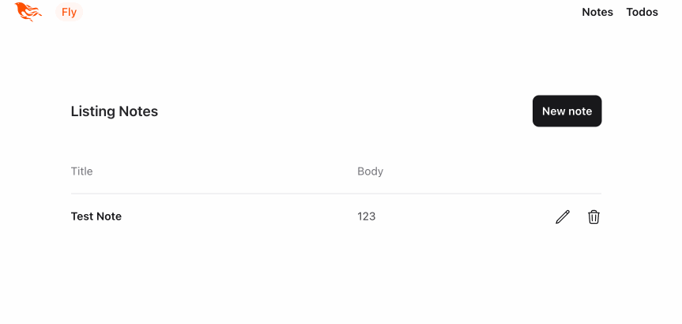

This post describes my efforts and approach to multi tenancy for a couple of Elixir/Phoenix/Ecto B2B applications I'm working on.   Hopefully, it will provide a fairly complete example for those looking to implement something similar, and help avoid a bunch of digging that I found myself doing. 

Since there are many different styles/implementations of multi tenancy, here is what I was trying to accomplish:

1. I should be able to centrally define a list of tenants and store some additional per-tenant meta-data.
2. For each tenant, I can configure one or more domains associated with that tenant.
3. When the site is accessed, the domain is looked up to determine which, if any, tenant is associated with that domain.
3. If a domain isn't owned by any tenant, raise an error.
4. Most (but not all) objects in the database are owned by a tenant.  Put differently, I need the ability to have some data which is common among tenants.
5. I, obviously, want to make it difficult (impossible, ideally) for data to accidentally bleed across tenants.

Additionally,

* I would like to be able to run reports / administrative actions which run across all tenants.
* I would like easy automated deployment to all tenants. (i.e. I don't want to be fighting against all of Ecto's great functionality)

For this post, and these projects, I've settled on *foreign-key style* multi tenancy, but here are the options I considered.

1. A **separate database per-tenant** obviously has strong isolation guarantees but does not scale efficiently with many small tenants.  It is complex to manage, and doesn't (easily) support cross-tenant reporting/actions.
2. Closely related is **prefix-based multi tenancy** (see [Multi tenancy with query prefixes](https://hexdocs.pm/ecto/multi-tenancy-with-query-prefixes.html) in the Ecto documentation) where each tenant is effectively a separate database stored under a different prefix/table-space in Postgres.  This has most of the strong isolation guarantees of separate databases with less overhead and the potential for some cross-tenant reporting (with a whole pile of unions).
    * Difficult to manage with out-of-the-box Ecto, although there are some 3rd party libraries that help with some of this.  
    * Since I'm aiming at many smaller tenants, I have some concerns over the migration time growing substantially with each new tenant.
3. The option I selected is **foreign-key based multi tenancy** (see [Multi tenancy with foreign keys](https://hexdocs.pm/ecto/multi-tenancy-with-foreign-keys.html) in the Ecto docs) where all tenants are stored in a single schema/database.  Tenants are defined in a `tenants` table and data that is owned by a tenant has a foreign-key back to that tenant.  While this is the easiest to manage, and the least overhead, it is not without some drawbacks such as...
    * very difficult backup/restore of a single tenant
    * much weaker isolation between tenants requires you to be super careful when writing queries
    * complicates the schema somewhat (all those foreign keys)

## The Sample App

I figured a simple sample application was in order for this, so I put together a really basic Phoenix/LiveView app consisting of "Notes" and "Todos".  Both have some basic management (listing, adding, editing, deleting), as seen here:

The initial schema is very simple:


erDiagram

TODOS {
    ID int pk
    NAME text 
    DONE boolean
}

NOTES {
    ID int pk
    TITLE text
    BODY text
}



The code for the initial version of this app (pre-multi tenancy) is [here](https://github.com/jclement/phoenix-multi-tenant-test/commit/317c3ee7e9d3b8e0d849f2fe48803a343ecced3e)

## Adding Multi-Tenancy Support

For fun, I decided that I'd only make the Todos multi tenant and leave Notes as global (obviously, ridiculous in #reallife).

### Schema Changes

First of all, I added the `tenants` table and the appropriate foreign key to the `todos` table.  Note, the `tenants` table contains a list of configured hostnames.  



erDiagram

TENANTS {
    ID int pk
    NAME text 
    HOSTS string[]
}

TODOS {
    ID int pk
    TENANT_ID int fk "References TENANTS.ID"
    NAME text 
    DONE boolean
}

TENANTS ||--|{ TODOS: owns

NOTES {
    ID int pk
    TITLE text
    BODY text
}



Here is the migration to create my tables (note: I'm starting fresh, not actually trying to add multi tenancy through a migration).


defmodule MultiTenant.Repo.Migrations.Init do
  use Ecto.Migration

  def change do
    create table(:tenants) do
      add :name, :string, null: false
      add :hosts, {:array, :string}
      timestamps(type: :utc_datetime)
    end

    create table(:todos) do
      add :name, :string, null: false
      add :done, :boolean, null: false, default: false
      add :tenant_id, references(
        :tenants, 
        on_delete: :delete_all), 
        null: false
      timestamps(type: :utc_datetime)
    end

    create table(:notes) do
      add :title, :string, null: false
      add :body, :string
      timestamps(type: :utc_datetime)
    end
  end
end


and my `Tenant` schema:


defmodule MultiTenant.Tenants.Tenant do
  @moduledoc """
  The Tenants context. 
  """
  use Ecto.Schema

  schema "tenants" do
    # display name of the tenant
    field :name, :string

    # list of hostnames that the tenant is associated with
    field :hosts, {:array, :string}, default: []

    timestamps(type: :utc_datetime)
  end
end


And note the additional relationship added to my Todo schema.


defmodule MultiTenant.Todos.Todo do
  @moduledoc """
  A schema for a Todo.  These are stored per-tenant.
  """
  use Ecto.Schema
  import Ecto.Changeset

  schema "todos" do
    field :name, :string
    field :done, :boolean
    belongs_to :tenant, Tenant

    timestamps(type: :utc_datetime)
  end

  @doc false
  def changeset(note, attrs) do
    note
    |> cast(attrs, [:name, :done])
    |> validate_required([:name, :done])
  end
end


Now, I could try and be super careful and manually ensure that every read query I perform is properly scoped with a tenant ID but that's pretty difficult to get right.  The Ecto documentation offers up a [cool solution](https://hexdocs.pm/ecto/multi-tenancy-with-foreign-keys.html#adding-org_id-to-read-operations) by implementing `prepare_query/3` in the Repo.


defmodule MultiTenant.Repo do
  use Ecto.Repo,
    otp_app: :multi_tenant,
    adapter: Ecto.Adapters.Postgres

  require Ecto.Query

  @impl true
  def prepare_query(_operation, query, opts) do
    cond do
      # skip doing tenant things for schema_migrations and operations specifically opting out
      opts[:skip_tenant_id] || opts[:schema_migration] ->
        {query, opts}

      # add the tenant_id to the query
      tenant_id = opts[:tenant_id] ->
        {Ecto.Query.where(query, tenant_id: ^tenant_id), opts}

      # fail compilation if we're missing tenant_id or skip_tenant_id
      true ->
        raise "expected tenant_id or skip_tenant_id to be set"
    end
  end
end


With this change, things become a little safer.  I need to either specify a `tenant_id` with a query which then injects a new where clause into my query to filter based on that tenant_id, or I specify `skip_tenant_id` to explicit query without adding that context.

For example:

A simple, `Repo.all(Todo)` would fail because neither a `tenant_id` or `skip_tenant_id` option was provided.  So I can resolve it by adding the appropriate option:
* `Repo.all(Note, skip_tenant_id: true)` avoids the tenant check on this query (required since Note doesn't have a tenant).
* `Repo.all(Todo, tenant_id: 123)` specifies that this query is run for tenant "123" and `prepare_query/3` adds `where tenant_id=^tenant_id` to my query for me. 

The documentation goes a bit further and suggests we can avoid a bunch of extra work manually specifying a `tenant_id` option on each query by, instead, stuffing the `tenant_id` into the [process dictionary](https://hexdocs.pm/elixir/main/Process.html) (which is a handy place to store things since each request/LiveView is a separate process).  We need to add the following to our Repo.


  @impl true
  def default_options(_operation) do
    # pull tenant_id from the process dictionary, 
    # and add as default option on queries
    [tenant_id: get_tenant_id()]
  end

  @tenant_key {__MODULE__, :tenant_id}

  @doc """
  Set the tenant_id on the process dictionary.  Called by plugs.
  """
  def put_tenant_id(tenant_id) do
    Process.put(@tenant_key, tenant_id)
  end

  @doc """
  Get the tenant_id from the process dictionary.
  """
  def get_tenant_id() do
    Process.get(@tenant_key)
  end


With these changes in place, we need to make a few updates to our controllers.

For our multi tenant schemas, we can rely on `prepare_query/3` to add the tenant filter to our queries, but we do need to explicitly add the tenant to our inserts.  For example, note the additional `put_change/3` call in `Todos.create/1`.


  def create(attrs \\ %{}) do
    %Todo{}
    |> Todo.changeset(attrs)
    # Ensure the tenant_id is added to new records
    |> put_change(:tenant_id, MultiTenant.Repo.get_tenant_id())
    |> Repo.insert()
  end


Similarly, for our non-multi tenant schemas (such as Notes) we do need to explicitly opt out of the tenant behavior by adding `skip_tenant_id` to our query options, such as the following examples for `Notes.list/0` and `Notes.get!/1` below.


  def list() do
    Note
    |> order_by(desc: :inserted_at)
    |> Repo.all(skip_tenant_id: true)
  end

  def get!(id), do: Repo.get!(Note, id, skip_tenant_id: true)



This same `skip_tenant_id` option allows us to issue administrative/reporting queries than span tenants.


So, for each process (connection/LiveView socket) we need to call `put_tenant_id/1` to store the tenant ID in the process dictionary, and Ecto will take care of adding the tenant ID to the options for each query, if no other options are specified, and when our previously implemented filtering will apply.

That leaves the next question... *"How do we get the tenant?"*

### Identifying Tenants 

First of all, in my implementation, the hostname the side is being accessed through decides the tenant.  I want to intercept every request and add the tenant information to the connection assigns, and store the tenant ID in the process dictionary for my previous Ecto configuration. Similarly, for my LiveViews, I'd like to ensure that the tenant is stored on the socket assigns so that I can do things like `<%= @tenant.name %>` in my views.

For this, I've implemented the following:


defmodule MultiTenantWeb.Plugs.TenantHandler do
  @moduledoc """
  The tenant handler plug, responsible for setting the tenant for the request
  """

  use MultiTenantWeb, :verified_routes
  use MultiTenantWeb, :controller

  import Plug.Conn

  alias MultiTenant.Tenants

  def fetch_tenant(conn, _opts) do
    case Tenants.get_tenant_by_hostname(conn.host) do
      {:ok, tenant} ->
        # add tenant ID to process dictionary to be used by DB operations
        MultiTenant.Repo.put_tenant_id(tenant.id)

        # add tenant to the session / assigns
        conn
        |> assign(:tenant, tenant)
        |> put_session(:tenant_id, tenant.id)

      {:error, _} ->
        # bail on unknown tenant
        conn
        |> put_status(404)
        |> put_view(MultiTenantWeb.ErrorHTML)
        |> render("unknown_tenant.html")
        |> halt()
    end
  end

  def on_mount(:default, _map, %{"tenant_id" => tenant_id}, socket) do
    # copy the tenant_id from the session to the socket for live views
    {:cont,
     socket
     |> Phoenix.Component.assign_new(:tenant, fn ->
       MultiTenant.Repo.put_tenant_id(tenant_id)
       Tenants.get_tenant!(tenant_id)
     end)}
  end
end


Which also requires us to add a controller and some helpers for our Tenants.


defmodule MultiTenant.Tenants do
  @moduledoc """
  The Tenants context.
  """

  import Ecto.Query, warn: false
  alias MultiTenant.Repo
  alias MultiTenant.Tenants.Tenant

  @doc """
  Get the tenant by the hostname (from host header)

  example:

      {:ok, tenant} = MultiTenant.Tenants.get_tenant_by_hostname("example.com")
      {:error, :not_found} = MultiTenant.Tenants.get_tenant_by_hostname("badexample.com")
  """
  def get_tenant_by_hostname(host) do
    tenant = Repo.one(from(r in Tenant, where: ^host in r.hosts), skip_tenant_id: true)

    if tenant do
      {:ok, tenant}
    else
      {:error, :not_found}
    end
  end

  @doc """
  Get the tenant by the tenant id
  """
  def get_tenant!(id) do
    Repo.get!(Tenant, id, skip_tenant_id: true)
  end

end


Now we can add this to our `:browser` pipeline, by adding the following near the end of the pipeline in `router.ex`.

  
  import MultiTenantWeb.Plugs.TenantHandler
  pipeline :browser do
    plug :accepts, ["html"]
    plug :fetch_session
    plug :fetch_live_flash
    plug :put_root_layout, html: {MultiTenantWeb.Layouts, :root}
    plug :protect_from_forgery
    plug :put_secure_browser_headers
    plug :fetch_tenant
  end


And, to enable this in our LiveViews, we add our new code to each LiveView mount by updating `MultiTenantWeb.live_view/0`.


  def live_view do
    quote do
      use Phoenix.LiveView,
        layout: {MultiTenantWeb.Layouts, :app}

      # always set the tenant for live views
      on_mount MultiTenantWeb.Plugs.TenantHandler

      unquote(html_helpers())
    end
  end


And with that, in my development environment, if I add tenants to the `tenants` table (I didn't bother with adding a UI for it in this example) with configured hostnames (various aliases to 127.0.0.1), everything just appears to work.

However, when I push this app to Production ([fly.io](https://fly.io) for me), it doesn't work and you'll see messages about origin verification in the logs.  The reason is the `:check_origin` flag on the Endpoint.  

The default behavior for `:check_origin` is:
* Disabled for development version.  (i.e. any name is permitted)
* Enabled and set to hostname for Production. (i.e. only the single configured hostname, defined through an environment variable, is permitted)

So, we need to update our application to allow any hostname configured for any of our tenants, instead of being limited to just a single hostname.

#### Origin Verification

Fortunately, the documentation suggests that we can use a function for `:check_origin`:

> :check_origin - if the transport should check the origin of requests when the origin header is present. May be true, false, a list of hosts that are allowed, or a function provided as MFA tuple. Defaults to :check_origin setting at endpoint configuration.
> ...
> Or a custom MFA function:
>
> check_origin: {MyAppWeb.Auth, :my_check_origin?, []}
>
>The MFA is invoked with the request %URI{} as the first argument, followed by arguments in the MFA list, and must return a boolean.

So, we can create a new module to verify origins:


defmodule MultiTenantWeb.VerifyOrigin do
  @moduledoc """
  This module is responsible for verifying the origin of the request from the configured tenants
  """
  require Logger

  def verify_origin?(%URI{} = uri) do
    uri.host in MultiTenant.Tenants.list_origins()
  end
end


And add a new `list_origins/0` function on our tenant controller.


defmodule MultiTenant.Tenants do
  @moduledoc """
  The Tenants context.
  """

  import Ecto.Query, warn: false
  alias MultiTenant.Repo
  alias MultiTenant.Tenants.Tenant

...

  @doc """
  Get origins for all tenants
  """
  def list_origins() do
    Tenant
    |> select([t], t.hosts)
    |> Repo.all(skip_tenant_id: true)
    |> Enum.flat_map(& &1)
  end
end


And then update the Endpoint in `config/runtime.exs` to use our new function.


  config :multi_tenant, MultiTenantWeb.Endpoint,
    url: [host: host, port: 443, scheme: "https"],
    http: [
      ip: {0, 0, 0, 0, 0, 0, 0, 0},
      port: port
    ],
    secret_key_base: secret_key_base,
    check_origin: {MultiTenantWeb.VerifyOrigin, :verify_origin?, []}


Finally, tenant hostnames don't change very often, and we're busy running a query on many requests / new LiveView sockets.  There are lots of ways to optimize this, but the great [Memoize](https://hexdocs.pm/memoize/readme.html) module provides an easy option.  Here, I'm caching the list of valid hostnames for 60 seconds (note: caching the list of valid lookups, rather than caching individual lookup results so that a malicious user can't run me out of memory by issuing millions of invalid requests).


defmodule MultiTenantWeb.VerifyOrigin do
  @moduledoc """
  This module is responsible for verifying the origin of the request from the configured tenants
  """
  use Memoize
  require Logger

  def verify_origin?(%URI{} = uri) do
    uri.host in origins()
  end

  defmemop origins(), expires_in: 60 * 1000 do
    MultiTenant.Tenants.list_origins()
  end
end


### BONUS: PubSub

I'll often use PubSub to refresh parts of the UI when things change.  A common pattern I've adopted is implementing that in the controller by adding `broadcast\2` and `subscribe\0` functions, and calling `broadcast\2` from each update/create/delete call (like so).


  def update(%Note{} = note, attrs) do
    note
    |> Note.changeset(attrs)
    |> Repo.update(skip_tenant_id: true)
    |> broadcast(:update)
  end
    
  @topic "notes"
  def broadcast({:ok, question}, tag) do
    Phoenix.PubSub.broadcast(
      MultiTenant.PubSub,
      @topic,
      {__MODULE__, tag, question}
    )

    {:ok, question}
  end

  def broadcast({:error, _reason} = error, _tag), do: error

  def subscribe do
    Phoenix.PubSub.subscribe(MultiTenant.PubSub, @topic)
  end


In my LiveViews, I can then subscribe and implement `handle_info\2` to handle the events.


  @impl true
  def mount(_params, _session, socket) do
    if connected?(socket) do
      Notes.subscribe()
    end

    {:ok,
     socket
     |> assign(:page_title, "Notes")
     |> assign(:notes, Notes.list())}
  end

  @impl true
  def handle_info({MultiTenant.Notes, _, _}, socket) do
    {:noreply, socket |> assign(notes: Notes.list())}
  end


For my per-tenant entities, I just adjust the topic to be derived from the tenant ID like this:


  defp topic do
    "todos/#{MultiTenant.Repo.get_tenant_id()}"
  end

  defp broadcast({:ok, question}, tag) do
    Phoenix.PubSub.broadcast(
      MultiTenant.PubSub,
      topic(),
      {__MODULE__, tag, question}
    )

    {:ok, question}
  end

  defp broadcast({:error, _reason} = error, _tag), do: error

  def subscribe do
    Phoenix.PubSub.subscribe(MultiTenant.PubSub, topic())
  end


This ensures that my LiveViews are only receiving events for changes within the correct tenant.

### BONUS: Oban

I use Oban for some background work.  Oban doesn't play well with our helpful `prepare_query\3` implementation.  Fortunately, there is an easy fix.  Oban allows us to specify a *prefix* to keep Oban's tables separate from the rest of them.  We can then update our `prepare_query\3` function to ignore queries in that prefix.

So...

In our migration where Oban's tables are added, we need to specify our prefix:


defmodule MultiTenant.Repo.Migrations.Oban do
  use Ecto.Migration

  def up do
    Oban.Migration.up(version: 11, prefix: "oban")
  end

  # We specify `version: 1` in `down`, ensuring that we'll roll all the way back down if
  # necessary, regardless of which version we've migrated `up` to.
  def down do
    Oban.Migration.down(version: 1, prefix: "oban")
  end
end


In `config/config.exs` where Oban is configured, we also need to specify the prefix so that Oban knows where we put its tables.


config :multi_tenant, Oban,
  repo: MultiTenant.Repo,
  # Put OBAN in a separate prefix to avoid conflicts with the query validation
  prefix: "oban",
  plugins: [
    Oban.Plugins.Pruner,
    {Oban.Plugins.Cron,
     crontab: [
       {"* * * * *", MultiTenant.Jobs.Counter}
     ]}
  ],
  queues: [default: 2]


And, finally, we need to update `prepare_query\3` to ignore queries against that prefix.


@impl true
  def prepare_query(_operation, query, opts) do
    cond do
      # skip doing tenant things for any operations against the OBAN schema
      opts[:prefix] == "oban" ->
        {query, opts}

      # skip doing tenant things for schema_migrations and operations specifically opting out
      opts[:skip_tenant_id] || opts[:schema_migration] ->
        {query, opts}
...


With these changes, Oban works just fine without Oban's internal queries running afoul of our multi tenant safety checks.  Thankfully, operations issued by Oban are still subject to our safety checks.

## Completed Project

Hopefully this helps lay out an approach to multi tenancy in Phoenix.  I'm still fairly new to Elixir/Phoenix so if something I've said in here is blatantly wrong, please leave a comment or email and I'll update!

The "completed" project is available [here](https://github.com/jclement/phoenix-multi-tenant-test) for reference.

